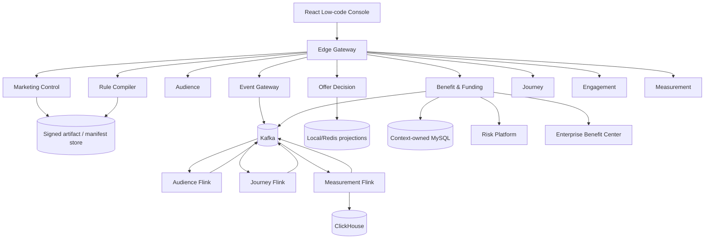
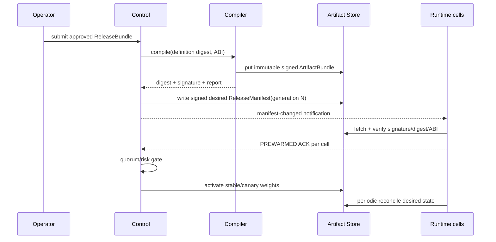

# 系统架构与上下文映射

## 架构原则

系统分为控制面、同步决策面、异步运行面和数据分析面。控制面追求可审计与正确发布；同步决策面追求低尾延迟、纯函数和无远程强依赖；异步运行面通过 Kafka/Flink 容忍重复与乱序；资金权益面以 MySQL 权威账本守恒。任何跨边界交互都经过版本契约，不共享领域实体或数据库表。

## 限界上下文

| Deployable | Owns | 同步依赖约束 | 权威存储 |
| --- | --- | --- | --- |
| `marketing-control-service` | Campaign、DefinitionVersion、ApprovalCase、ReleaseBundle/Manifest | 发布时调用编译/ACK；不参与在线 evaluate | `marketing_control` + S3 manifest |
| `rule-compiler-worker` | 编译请求、报告、ArtifactBundle | worker 无外网；不读取运行时数据库 | S3 artifact；本地实现为内存 adapter |
| `audience-service` | 字段注册、人群版本、导入、快照 metadata | preview 可访问许可的数据 adapter | `marketing_audience` + S3/Redis projection |
| `offer-decision-service` | 已激活 generation、决策 trace handle | evaluate 禁止同步访问控制库/画像/Benefit | 进程内不可变快照 + Redis 有界 fallback |
| `benefit-funding-service` | PromotionApplication、Reservation、ResourceAccount、资金/库存流水、AwardIntent 与风险拦截记录 | 验签 OfferToken；发奖前调用风控；仅 CENTER 模式异步投递权益中台 | `marketing_benefit` |
| `event-gateway-service` | 接入幂等、schema 结果、quarantine | 只做验证和路由 | `marketing_events` + Kafka |
| `journey-service` | Journey 投影、实例查询、迁移命令 | 状态机执行在 Flink | `marketing_journey` + Flink state |
| `engagement-service` | Consent、Suppression、Template、ContactAttempt、Provider receipt | 副作用前重新检查策略 | `marketing_engagement` |
| `measurement-service` | 指标、归因策略、水位、重算任务、客服 trace | 查询 ClickHouse 投影 | `marketing_measurement` + ClickHouse |
| `edge-gateway` | 路由、边界身份传播 | 不拥有领域状态 | 无 |

每个有数据库的服务拥有独立 schema/账号；即使本地共享一个 MySQL 实例，也禁止跨 schema join。公共模块只允许共享技术值对象、事件信封、错误和 SPI，禁止共享 JPA entity、repository 或领域 aggregate。

## 持久化分层

有数据库的服务统一采用 `Application Service → Repository Port → MyBatis Repository Adapter → Mapper Interface → Mapper XML`。应用层定义面向业务语义的持久化端口，只负责事务编排和领域规则；`infrastructure/persistence` 实现端口并处理重复键、影响行数等数据库语义；SQL 只能放在 `src/main/resources` 下的 Mapper XML，Java Mapper 只声明类型安全的方法签名。架构测试同时阻止 application 依赖 JDBC、MyBatis 或持久化适配器，并扫描 Java 主代码中的内联 SQL。

## 控制面到运行面的发布协议

Kafka 通知不是真相源。Runtime 启动或检测到 generation gap 时读取 Manifest；Manifest 不可变且签名。没有满足预热 ACK 的 cell 不接新 generation。稳定、灰度和多个保留 generation 可共存，路由使用 `tenant + subject + release` 的稳定 hash。

## 一致性模型

- 单聚合事务：本地 MySQL ACID；写业务状态与 outbox 同事务。
- 跨上下文：at-least-once 事件 + eventId 去重 + 幂等 command；不使用 XA。
- 在线决策：规范化输入 + 固定 artifact/generation 的纯函数，结果可字节级复现。
- 外部副作用：`enrollmentId + nodeExecutionId + attemptPurpose` 或订单 commandId 作为业务幂等键；超时结果进入 UNKNOWN 并以查询/回执收敛，不能盲重试。
- 发奖切流：租户默认只能是 `LEGACY` 或 `SHADOW`；只有逐租户显式配置为 `CENTER` 才写待投递 AwardIntent。组装、风控调用均在数据库事务外完成，短事务只保存首次 outbox 或 block 结果，两者不能同时存在。
- 权益中台投递：CENTER outbox 与 `marketing.award-expected.v1` 应发事实同事务提交；HTTP relay 通过租约版本 fencing、原 `sourceRequestId` 幂等键、单租户批量上限和熔断收敛，成功后回填权益订单号。
- 资金/库存：数据库条件更新、fencing token、不可变流水和周期对账；Redis bucket 只做预分配加速，不是最终账本。
- 分析：原始事实可重放，ClickHouse projection 可重建；所有查询带 watermark。

## 请求和事件路径

所有 HTTP 请求在网关和目标服务各自验证 JWT。`TenantContextFilter` 从可信 token claims 构造 `TenantScope`，应用层显式携带 tenant；生产关闭 `X-Dev-*`。事件使用 CloudEvents 风格 envelope，tenant、schemaVersion、eventId、occurredAt、subject token 和 trace context 都是契约字段；消费者先验 schema/tenant，再去重和处理。

## 可用性与隔舱

- Kubernetes 至少 2 副本；Decision、Benefit、Event Gateway 默认 3 副本；PDB + topology spread + HPA。
- Decision 不依赖控制库；S3 故障期间继续使用已验签稳定制品，新 Pod 没有可验证制品时 readiness=false。
- IdP 故障不影响已验证且未过期的 JWT，请求是否继续由 token TTL 和本地 JWK cache 决定；登录和刷新不可用。
- TenantBulkhead、租户令牌桶、数据库池、Kafka 分区和连接器队列共同隔离 noisy tenant。
- OTel exporter 有界队列和采样；遥测后端阻塞不得阻塞决策线程。

## 演进约束

API/Event/DSL/Artifact 支持 N/N-1。数据库一律 expand → dual-read/write（必要时）→ backfill → switch → contract。版本移除必须先证明无旧 producer、consumer、definition、running enrollment 和 rollback generation。架构门禁位于 `architecture-tests`，契约门禁由 `scripts/verify-contracts.sh` 执行。
