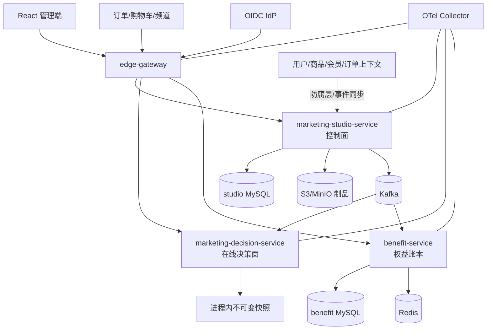

# 营销低代码平台首期交付方案

> **已拒绝并停止使用（2026-09-02）**：本方案把异步用户旅程延后，且发布一致性、签名报价、权益资金闭环、测量归因和生产准入证据不足，无法满足用户最新的“一期完整、不分期”要求。唯一有效替代方案为 [`../marketing-platform-complete/DELIVERY_PLAN.md`](../marketing-platform-complete/DELIVERY_PLAN.md)，拒绝原因见 [`../marketing-platform-complete/ADVERSARIAL_DESIGN_REVIEW.md`](../marketing-platform-complete/ADVERSARIAL_DESIGN_REVIEW.md)。本文件仅保留作决策审计，不得作为实现依据。

## Requirement

从零建设一套面向现代零售电商、参考京东式业务复杂度的营销低代码平台。平台包含 Web 管理端和 Java 服务端，采用 DDD 与微服务架构，支持业务人员可视化配置活动、规则校验与仿真、四眼审批、版本发布、低延迟在线决策、权益幂等发放、审计与生产运维。

本交付把两类常被混淆的“营销低代码”明确拆开：

1. **一期：同步优惠决策**。请求到来时，在毫秒级内完成活动候选、资格、门槛、权益计算、互斥叠加和限领判断。典型场景包括满减、折扣、直降、阶梯优惠、买赠、优惠券、秒杀资格和加价购。
2. **二期：异步用户旅程**。事件触发、等待、分支、频控、短信/Push/站内信触达和转化归因。它有持久化计时器与长事务语义，不与在线优惠决策共用运行时。

一期将交付可运行的 production-candidate 基线，而不是宣称在缺少真实流量、数据规模、机房和上下游的情况下已经达到“京东生产规模”。生产准入仍需真实环境容量测试、灾备演练、安全测评及外部系统联调。

## Repository Evidence

- 目标目录 `marketing-lowcode-platform/` 是全新绿地项目；用户明确要求不参考工作区既有项目业务和实现。
- 当前没有目标仓库、历史代码、构建系统、CI provider 或现存数据需要兼容。
- 方案采用截至 2026-09-02 可由官方资料验证的基线：Java 21；Spring Boot 4.1.x；Spring Cloud 2025.1.x；Drools 10.2.x。
- Spring 官方兼容矩阵显示 Spring Cloud 2025.1.x 对应 Spring Boot 4.0/4.1，并建议用 release-train BOM 管理依赖：[Spring Cloud](https://spring.io/projects/spring-cloud/)。
- Spring Boot 4.1.1 支持 Java 17–26，因此 Java 21 LTS 在支持范围内：[Spring Boot System Requirements](https://docs.spring.io/spring-boot/system-requirements.html)。
- Apache KIE 官方推荐微服务/云原生场景使用 Rule Unit，并推荐 executable model，避免把规则编译开销放在请求期：[Drools Getting Started](https://kie.apache.org/docs/10.1.x/drools/drools/getting-started/index.html)、[Build and Run](https://kie.apache.org/docs/10.0.x/drools/drools/KIE/index.html)。
- React Flow 提供节点拖放、缩放、选择、键盘操作、MiniMap 等画布基础能力，适合构建规则设计器：[React Flow](https://reactflow.dev/)。
- 事务 outbox 用于避免业务表提交成功但领域事件发送失败；该模式的目标和 CDC 路由由 Debezium 官方文档明确描述：[Debezium Outbox Event Router](https://debezium.io/documentation/reference/stable/transformations/outbox-event-router.html)。
- Kubernetes 自带 Service/DNS 发现、扩缩容和故障转移能力，生产环境不再额外引入一套注册中心；本地使用 Docker Compose：[Kubernetes Services](https://kubernetes.io/docs/concepts/services-networking/service/)。

## Feasibility

- Verdict: **conditional-go**
- 可行条件：
  - 一期聚焦同步优惠决策闭环，不把 CDP、广告投放、全渠道旅程和财务结算一并纳入。
  - 浏览器前端采用 React + TypeScript；“Java 语言”约束用于所有服务端、领域模型、编译器和决策引擎。浏览器端若强制 Java/Vaadin，会显著限制节点画布生态，需作为范围变更处理。
  - 生产规模目标先作为 SLO/容量模型，必须通过目标硬件上的压测后才转为承诺。
  - 用户、商品、订单、会员、门店、支付和消息触达作为外部限界上下文，通过防腐层接入，不在一期重造。
- Dependencies:
  - JDK 21、Maven 3.9+、Node.js 22 LTS、pnpm。
  - MySQL 8.4 LTS、Redis、Kafka、对象存储（生产 S3 兼容，本地 MinIO）、OIDC 身份提供方。
  - 本地开发可用 Docker Compose；服务单元测试不强制依赖 Docker，集成测试使用 Testcontainers。
- Risks and mitigations:
  - **大促流量突增**：在线决策热路径不访问控制面数据库、不同步调用用户画像；使用不可变本地快照、无状态实例和水平扩容。
  - **规则误发资金**：低代码 DSL 只允许白名单字段/算子/动作；发布前静态检查、样例金标、影响预估、四眼审批；运行时金额上限、预算和熔断 fail-closed。
  - **动态代码执行风险**：不允许业务用户提交 DRL、SpEL、Groovy 或 Java；只由受控编译器把类型化 IR 生成 DRL，RHS 只能生成候选结果。
  - **规则版本漂移**：发布物不可变、SHA-256 校验、代际指针 CAS、current/previous 双槽、按请求固定 artifact version。
  - **消息重复/乱序**：outbox + Kafka at-least-once；消费者按 `eventId` 去重、按聚合版本拒绝旧事件。端到端不宣传虚假的 exactly-once。
  - **超卖/超预算**：决策只报价；实际权益由 Benefit 服务通过幂等键和数据库条件更新完成预占/确认/释放，热点库存后续演进为分桶。
  - **微服务分布式单体**：数据库按服务所有权隔离；禁止跨库 join；同步调用仅用于必要命令，发布和决策日志走事件。
  - **Drools 新版本兼容**：用 `RuleExecutor` SPI 隔离，首期锁定 10.2.x；编译器契约、金标集和性能基准必须过门禁才能升级。

### Approaches

**Chosen: 控制面/决策面分离 + 类型化低代码 DSL + 混合规则执行。**

- 控制面保存草稿图，做领域校验、仿真、审批和编译。
- 编译产物包含 canonical JSON、类型化 IR、受控生成的 DRL、元数据、SHA-256 和兼容版本。
- 决策面在请求线程外构建 KieBase/执行计划，校验后原子切换不可变快照。
- 资格与多规则推理由 Drools Rule Unit/executable model 承担；金额计算、互斥叠加、封顶和舍入由纯 Java 领域服务承担，避免把资金算法散落在规则 RHS。

**Rejected alternatives:**

- **所有能力都写成 DRL**：业务可读性、资金计算可验证性、升级和性能治理较差；规则引擎只用于它擅长的匹配与推理。
- **直接执行前端 JSON 图**：上线简单但缺少编译期类型检查、不可变发布物和稳定性能，不适合生产热路径。
- **让业务上传任意脚本**：安全边界不可控，难以确定性回放与审计。
- **一开始拆成十几个服务**：团队和运维成本会先于业务收益到来；一期只物理拆四个核心服务，其余以端口和模块边界预留。
- **BPMN 统一承载优惠决策与用户旅程**：同步决策和长时间工作流的状态/延迟/失败语义完全不同，统一运行时会增加复杂度。
- **初期 Event Sourcing**：审计价值存在，但系统成熟前会引入投影、回放和迁移负担；一期采用状态存储 + append-only 审计 + outbox。

## Product Design

### Actors and goals

| Actor | Goal | Key permission |
| --- | --- | --- |
| 营销运营 | 用模板或画布创建活动、校验和仿真 | `campaign:edit`, `campaign:submit` |
| 审核人 | 查看版本 diff、风险和仿真结果，批准或驳回 | `campaign:review` |
| 发布人 | 灰度发布、全量、回滚 | `campaign:publish` |
| 研发/策略人员 | 注册字段、算子、节点插件，维护金标样例 | `schema:manage` |
| 客服/审计 | 按请求查看命中与未命中原因 | `decision:read` |
| 业务系统 | 请求优惠决策、预占/确认/释放权益 | service account |

### Ubiquitous language

- **Campaign（活动）**：稳定业务身份，跨多个不可变版本。
- **CampaignVersion（活动版本）**：一次可审核、可发布、不可覆盖的配置快照。
- **RuleGraph（规则图）**：运营在画布配置的安全 DSL。
- **RuleArtifact（规则制品）**：编译后的不可变运行物。
- **ReleasePointer（发布指针）**：某租户/业务线/环境当前生效代际。
- **Decision（决策）**：在固定制品版本和上下文下的确定性结果。
- **BenefitIntent（权益意图）**：决策产生的待发放权益，不等同于已经到账。
- **Grant（发放单）**：权益服务内具备幂等和状态机的实际预占/发放记录。
- **StackGroup（叠加组）**：同组互斥、跨组按策略叠加的优惠集合。

### Primary workflow


### Scope

- 多租户、业务线、渠道和环境隔离。
- 活动列表、模板库、可视化规则画布、属性面板、校验面板、仿真实验室、版本 diff、审核/发布中心、决策追踪。
- 节点：Start、商品/店铺/渠道作用域、用户标签、人群、订单条件、时间窗、次数限制、Benefit、StackPolicy、End。
- 算子：`EQ/NE/GT/GTE/LT/LTE/IN/NOT_IN/BETWEEN/CONTAINS`；强类型 NUMBER/STRING/BOOLEAN/ENUM/DATE_TIME/STRING_SET。
- 玩法：满减、每满减、阶梯减、折扣+封顶、直降、一口价、买赠、券权益、加价购（首期至少以满减、折扣、买赠完成真实纵切，其余通过插件扩展）。
- 生命周期：DRAFT → IN_REVIEW → APPROVED → PUBLISHED → PAUSED/ENDED；拒绝回 DRAFT 并形成新修订。
- 版本级四眼原则、乐观锁、幂等发布、影子/灰度/全量、回滚。
- 在线决策、确定性解释轨迹、权益意图和权益服务幂等状态机。
- 审计、指标、追踪、告警规则、Docker 本地环境和 Kubernetes/Helm 生产基线。

### Out of scope for phase 1

- 用户画像计算和海量标签平台本身；只定义同步快照/缓存契约。
- 广告竞价、推荐排序、搜索、商品/订单/会员主数据。
- 短信、Push、企微等旅程触达和长时间工作流。
- 财务清结算、发票和支付逆向；只输出可对账的权益流水事件。
- 跨地域 active-active 和双写；文档给出演进方案，不在本地假装验证。
- 运营自由编写 Java/DRL/脚本。

### Business rules

1. 所有金额使用最小货币单位 `long`，币种显式；百分比使用 basis points，禁止 `double`。
2. 决策上下文必须带 tenant、requestId、occurredAt、channel、user/order/cart 标识；缺少规则所需字段时该候选 fail-closed，并返回原因码。
3. 同一活动版本的决策对相同规范化上下文必须可重放；随机红包等随机能力使用可审计的确定性种子。
4. 活动作用域先筛选，资格条件后判断，权益再计算，最后做互斥/叠加/封顶；顺序是领域不变量。
5. 同一 `stackGroup` 默认择优，跨组按优先级叠加；全局封顶最后应用。Tie-break 固定为优先级、优惠金额、发布时间、campaignId。
6. 编辑 PUBLISHED 活动必须产生新版本，不得原地覆盖。
7. 提交人不能审核自己的版本；发布权限与审核权限可分离。
8. 发布前必须通过图校验、规则编译、金标样例、风险上限检查和审批。
9. 决策结果不是发放成功；权益操作使用 `tenantId + bizOrderId + benefitId + action` 幂等。
10. 过期、暂停、预算不足、快照不兼容、规则异常一律不给新增权益；不得静默使用半编译配置。

## Acceptance Criteria

| ID | Observable behavior | Priority | Verification |
| --- | --- | --- | --- |
| AC-01 | 新环境可用一条文档化命令启动 gateway、studio、decision、benefit、console 及本地依赖，并通过健康检查 | P0 | Compose smoke + health API |
| AC-02 | OIDC/JWT 中的 tenant 和角色控制控制面 API；跨租户读取/修改返回 404/403，生产 profile 不信任客户端 tenant header | P0 | security integration tests |
| AC-03 | 控制台能从节点注册表生成画布与属性表单，创建、读取、更新 DRAFT 图；并用 ETag/版本号拒绝陈旧覆盖 | P0 | UI component + API integration tests |
| AC-04 | 图保存/提交前可识别缺 Start/End、断路、环、非法端口、类型不匹配、未知字段/算子、缺配置和复杂度超限，并返回节点级错误 | P0 | compiler golden tests + UI tests |
| AC-05 | 用户可用至少满减、折扣、买赠三种模板完成配置，并在仿真页看到命中结果、未命中原因、计算步骤、制品版本 | P0 | full-stack E2E |
| AC-06 | 生命周期强制合法转换；提交人自审失败；审核能看到 canonical diff、编译报告和样例结果 | P0 | workflow tests + E2E |
| AC-07 | 发布生成不可变制品与 SHA-256，在同一事务写 release/outbox；重复 publish 幂等，CAS 冲突不覆盖新代际 | P0 | MySQL/Testcontainers concurrency tests |
| AC-08 | 决策服务异步预热新制品，校验成功后原子切换；损坏/不兼容制品不影响 current，保留 previous 可回滚 | P0 | snapshot concurrency/failure tests |
| AC-09 | 在线决策不访问控制面数据库；在固定输入和版本下结果稳定，正确执行作用域、资格、金额、互斥叠加、封顶和 tie-break | P0 | ArchUnit/guard + decision golden set |
| AC-10 | 权益预占、确认、释放支持重试幂等；并发下不超库存/预算，非法状态转换被拒绝 | P0 | benefit concurrency integration tests |
| AC-11 | 每次决策具有 requestId、artifactId、命中/拒绝 reasonCode 与步骤耗时；敏感字段不进入普通日志 | P0 | contract + log/metric tests |
| AC-12 | 关键指标可被 Prometheus 抓取，trace 可经 OTLP 导出；包含决策延迟/错误/降级、发布延迟、制品加载失败、权益冲突 | P1 | actuator/OTel smoke |
| AC-13 | 管理端覆盖 loading/empty/error/403/conflict/success 状态，桌面和平板可用，节点和连线支持键盘选择/删除，表单具备可见 label | P1 | Vitest + Playwright + axe |
| AC-14 | 后端 unit/integration/architecture tests、前端 lint/typecheck/unit/E2E/build、镜像构建和 SBOM/依赖漏洞扫描进入 CI | P0 | local parity + CI syntax |
| AC-15 | 提供 API、数据字典、架构、运行、扩容、告警、发布、回滚、对账和故障排查文档，且命令与最终代码一致 | P1 | docs verification checklist |
| AC-16 | 基准场景在目标硬件上可重复压测；本地只记录实测值，不伪造 100k QPS。生产准入目标为决策 API p99 ≤ 30ms、单实例无外部 I/O 热路径、可水平扩展 | P1 | JMH + k6/Gatling report |

## UI/UX Design

- Applicability: **Applicable**。低代码能力的核心就是用户可视化界面。
- Information architecture:
  - 工作台：活动状态、发布健康、预算/库存风险、近期告警。
  - 活动：列表、模板、新建、设计器、版本、审核。
  - 决策：仿真实验室、请求追踪。
  - 资产：权益、字段/节点注册表（首期只读或管理员维护）。
  - 运维：发布中心、快照状态、回滚。
- Designer layout:

```text
┌──────── 顶栏：活动名 / Draft v3 / 保存 / 校验 / 提交审核 ────────┐
│ 节点库  │              规则画布                │ 属性检查器      │
│ 触发器  │  [Start] → [商品范围] → [订单≥199]   │ 节点名称        │
│ 条件    │                         ↘ [满减30] → │ 字段/算子/值    │
│ 权益    │                         ↗ [会员PLUS] │ 错误与帮助      │
│ 策略    │  MiniMap / Zoom / Undo / Redo        │                │
├─────────┴──────────────────────────────────────┴────────────────┤
│ 校验抽屉：2 errors / 1 warning ｜ 点击定位 ｜ 影响预估 ｜ 样例结果 │
└─────────────────────────────────────────────────────────────────┘
```

- Interaction:
  - 拖入节点后只能连接兼容端口；不兼容连接即时拒绝并说明原因。
  - 属性由后端 Node Definition 的 JSON Schema 驱动，前端不硬编码业务字段枚举。
  - 自动保存只保存草稿，不能自动发布；保存冲突展示远端版本与本地未保存修改，不做静默覆盖。
  - 提交审核前打开校验/风险摘要；高风险金额、无预算、超大人群显示阻断或警告。
  - 仿真可输入上下文、选择草稿/线上版本、对比结果；所有响应显示 `artifactId`。
- State matrix:
  - Loading：骨架屏，画布不可编辑。
  - Empty：提供“从模板开始”和“空白活动”。
  - Validation error：节点红边、问题面板聚合、保持用户输入。
  - 409 conflict：停止自动保存，提供重新加载和复制本地 JSON，不允许强制覆盖。
  - 401/403：登录或权限说明，不降级成匿名写操作。
  - Publish partial failure：明确“控制面已提交/决策面未激活”等阶段状态，并提供重试。
  - Runtime unavailable：仿真失败与规则不命中严格区分。
- Responsive:
  - ≥1280px 三栏；768–1279px 节点库/属性检查器使用可折叠抽屉；手机仅支持查看和审批，不承诺完整拖拽设计。
- Accessibility:
  - 节点/边可 Tab 聚焦，Enter 选中，Delete 删除；画布操作有 toolbar 等价入口。
  - 状态不只依赖颜色；错误通过 `aria-describedby` 关联；对话框管理焦点并支持 Escape。

## Technical Solution

### System context and physical services



一期物理服务：

| Service | Bounded context | Owns | Must not own |
| --- | --- | --- | --- |
| `edge-gateway` | Edge/IAM adapter | 路由、token relay、粗粒度限流、correlation ID | 业务编排、规则判断 |
| `marketing-studio-service` | Campaign + Rule Authoring + Release | 活动聚合、规则图、版本、审核、编译、制品、发布指针、outbox、审计 | 在线高 QPS 决策、权益账本 |
| `marketing-decision-service` | Decision | 已发布制品快照、候选/计算/叠加、解释轨迹、决策事件 | 活动草稿、DDL、权益扣减 |
| `benefit-service` | Benefit Ledger | 权益定义、预算/库存、Grant 状态机、幂等、outbox、对账 | 活动规则设计 |
| `marketing-console` | Web UI | 运营交互、本地编辑状态 | 业务真值和规则执行 |

二期独立增加 `audience-service`、`journey-service`、`touchpoint-service`、`measurement-service`；一期用 ports/adapters 定义契约，不建立空壳微服务。

### DDD and package boundaries

每个 Java 服务采用 hexagonal/clean 分层，领域层不依赖 Spring、JPA、Kafka 或 Web：

```text
com.acme.marketing.<context>
├── domain
│   ├── model          Aggregate / Entity / Value Object / Domain Event
│   ├── service        跨实体领域策略
│   └── port           Repository / Clock / IdGenerator 等端口
├── application
│   ├── command        写用例与事务边界
│   ├── query          读模型
│   └── dto            用例级 DTO
└── adapter
    ├── in.web         REST、鉴权映射、错误协议
    └── out            persistence / kafka / object-storage / oidc
```

ArchUnit 固定依赖方向：`domain <- application <- adapter`。服务间仅共享技术级 API/event contracts，不共享 JPA entity、repository 或领域 aggregate。

### Aggregate design

**Campaign aggregate**

- Root: `Campaign(campaignId, tenantId, bizLine, name, currentRevision)`。
- Child/related immutable entity: `CampaignVersion(version, graph, validity, state, submitter, riskSummary, rowVersion)`。
- Invariants: published version immutable；同一 campaign 至多一个编辑草稿；合法状态机；有效期、币种和预算引用一致。

**RuleArtifact aggregate**

- `ArtifactId`, `schemaVersion`, `engineVersion`, `canonicalGraph`, `typedIr`, `generatedDrl`, `testReport`, `checksum`, `createdAt`。
- 制品内容不可更新；重新编译产生新 artifact。

**Release aggregate**

- 维度 `(tenantId, bizLine, environment)`，包含 generation、currentArtifactSet、previousArtifactSet、rollout policy、rowVersion。
- 发布通过 CAS 推进 generation；回滚创建新的 generation 指向 previous，而不是篡改历史。

**BenefitInventory aggregate**

- `BenefitDefinition` 与 `InventoryBucket` 分离；Grant 是独立 aggregate。
- `GrantOrder` 状态：`RESERVED -> CONFIRMED | RELEASED | EXPIRED`，所有转换幂等。

### Low-code meta-model

```json
{
  "schemaVersion": "1.0",
  "graphId": "uuid",
  "nodes": [
    {"id":"start","type":"START","version":1,"config":{}},
    {"id":"c1","type":"ORDER_AMOUNT","version":1,
     "config":{"operator":"GTE","amountMinor":19900,"currency":"CNY"}},
    {"id":"b1","type":"FIXED_DISCOUNT","version":1,
     "config":{"amountMinor":3000,"stackGroup":"ORDER_PROMO"}},
    {"id":"end","type":"END","version":1,"config":{}}
  ],
  "edges": [
    {"id":"e1","source":"start","sourcePort":"out","target":"c1","targetPort":"in"},
    {"id":"e2","source":"c1","sourcePort":"matched","target":"b1","targetPort":"in"},
    {"id":"e3","source":"b1","sourcePort":"out","target":"end","targetPort":"in"}
  ]
}
```

Node Definition 由后端注册表提供：`type/version/category/title/inputPorts/outputPorts/configJsonSchema/runtimeCapability/deprecation`。保存时固定节点版本；schema 升级必须通过显式迁移器，不自动改变旧活动语义。

编译流水线：

1. JSON Schema 结构校验。
2. 图校验：唯一 Start/End、可达、无环、端口/类型兼容、节点/边/深度上限。
3. 领域校验：金额、时间、作用域、权益、预算、叠加组、字段可用性。
4. 规范化：稳定排序、默认值展开、金额/时间标准化，生成 canonical JSON。
5. 生成 typed IR；条件子图生成白名单 DRL/Rule Unit，权益动作为受控 `CandidateCollector`。
6. 编译 Drools executable model；执行金标和用户样例。
7. 生成 checksum、兼容矩阵和风险报告，写不可变制品。

### Runtime decision pipeline

```text
normalize request
  -> locate tenant/biz/channel snapshot
  -> filter validity and scope
  -> execute eligibility rules (Drools, bounded firings/time)
  -> calculate benefits (pure Java Money/Benefit calculators)
  -> group/exclude/stack/tie-break
  -> enforce caps and runtime guards
  -> emit DecisionResult + ExplanationTrace + BenefitIntents
```

- 请求固定 `generation/artifactIds` 后完成，不在中途观察新发布。
- `KieBase` 在消费者线程编译/构建；验证失败不切换 current。
- 每请求创建/借用隔离 session，设置最大规则触发数和 deadline；finally 必须 dispose。
- explanation 默认只返回稳定 reasonCode；管理员按权限查询详细 trace，避免响应膨胀和规则泄露。
- 所有比例和金额算法集中在领域值对象，明确四舍五入和封顶顺序。

### API contracts (v1)

- Studio:
  - `GET /api/v1/node-definitions`
  - `POST /api/v1/campaigns`
  - `GET /api/v1/campaigns/{id}`
  - `PUT /api/v1/campaigns/{id}/draft` with `If-Match`
  - `POST /api/v1/campaigns/{id}/validate`
  - `POST /api/v1/campaigns/{id}/simulate`
  - `POST /api/v1/campaigns/{id}/submit`
  - `POST /api/v1/campaigns/{id}/review`
  - `POST /api/v1/releases` / `POST /api/v1/releases/{id}/promote|rollback`
- Decision:
  - `POST /api/v1/decisions/evaluate`
  - `GET /api/v1/decisions/{requestId}`（审计权限）
  - `GET /internal/v1/snapshots/{tenant}/{bizLine}`
- Benefit:
  - `POST /api/v1/grants/reserve`
  - `POST /api/v1/grants/{grantId}/confirm`
  - `POST /api/v1/grants/{grantId}/release`
  - `GET /api/v1/grants/by-business-key/{key}`
- 错误统一为 RFC 9457 Problem Details，扩展 `code`, `traceId`, `violations[]`, `retryable`。
- API 以 OpenAPI 3.1 记录；事件 envelope 包含 `eventId/type/version/occurredAt/tenantId/aggregateId/aggregateVersion/traceparent/payload`。

### Data ownership and schema

Studio MySQL tables:

- `mk_campaign`
- `mk_campaign_version`
- `mk_rule_graph`
- `mk_rule_artifact`
- `mk_release`
- `mk_release_item`
- `mk_review_record`
- `mk_outbox_event`
- `mk_audit_log`

Benefit MySQL tables:

- `mk_benefit_definition`
- `mk_inventory_bucket`
- `mk_grant_order`
- `mk_grant_ledger`
- `mk_outbox_event`

约束：所有业务唯一键带 tenant；软删除只用于草稿/定义，账本、审计、制品和发布历史 append-only；Flyway 管 DDL，所有生产 profile `ddl-auto=validate/none`。

### Transaction, concurrency and messaging

- Application command 是事务边界；领域模型不持有事务注解。
- `PUT draft` 使用 `If-Match`/row version；提交时重新校验当前版本。
- publish 在一个本地事务中写 artifact reference、release generation 和 outbox；对象存储上传先完成，数据库只引用已校验 checksum 的对象。
- outbox 首期提供 polling relay（`SELECT ... FOR UPDATE SKIP LOCKED`）；生产可切 Debezium CDC，不改变事件契约。
- 消费者 inbox 去重，按 aggregateVersion 单调应用；DLQ 只保存无法自动恢复的 poison event，并有重放 runbook。
- 权益库存使用条件更新 `available >= requested` 和唯一幂等键；死锁/瞬时冲突可有限重试，业务不足不重试。

### Security and isolation

- OIDC Authorization Code + PKCE（Web），JWT client credentials（服务）。
- tenant 从受信 issuer/audience 的 claim 解析；repository 查询必须显式 tenant scope；用架构测试禁止无 tenant 的业务 repository 方法。
- RBAC + resource attributes；提交、审核、发布职责分离。
- RuleGraph、请求体、字符串长度、节点数、边数、嵌套深度、集合基数均限制；上传原始脚本接口不存在。
- 审计记录 actor、tenant、action、target、before/after hash、reason、request/trace ID；敏感上下文只存散列或脱敏值。
- 镜像非 root、只读根文件系统、最小权限、依赖锁定、SBOM 和漏洞扫描；secret 只通过运行环境引用。

### Reliability and failure behavior

- Gateway timeout 小于调用方；decision 自身无同步下游依赖。
- Studio/Benefit 数据库故障不影响已加载规则的报价；Benefit 故障时不得声称发放成功。
- Snapshot store 保留 current/previous，发布加载异常报警但继续服务 current。
- readiness 只有在至少加载基础 snapshot 后才成功；liveness 不依赖数据库或 Kafka。
- 每个实例暴露 build/version/generation，便于识别混跑版本。
- 降级顺序：关闭问题 campaign → 回滚 generation → 限制非核心渠道 → 上一稳定应用版本。禁止用“任意默认优惠”降级。

### Observability

- Micrometer Prometheus + OpenTelemetry Java agent；官方说明 Java agent 可自动覆盖 HTTP、数据库等边界，并允许补充业务 span：[OpenTelemetry Java Agent](https://opentelemetry.io/docs/zero-code/java/agent/)。
- Metrics: request rate/error/duration、candidate/matched/rejected、rule firing/timeout、snapshot generation/load age/failure、publish lag、outbox lag、grant conflict/insufficient/idempotent hit。
- 所有 label 使用受控枚举，不把 userId/campaignId/requestId 放入 metrics label。
- Structured logs 带 traceId/requestId/tenantIdHash/generation/reasonCode；决策明细进专用审计事件，不写普通应用日志。
- SLO 初始目标：decision 99.99% availability、p99 ≤30ms；control plane 99.9%。以实际压测校准 error budget。

### Compatibility and migration

- 绿地项目无历史数据迁移。
- 所有 API `/v1`；Node Definition、Graph、IR、Artifact、event 各自版本化。
- 服务只激活声明兼容的 artifact；不兼容时保留 current 并报警。
- DB 只做 expand/contract migration；先兼容读写新旧字段，再回填，最后删除旧字段。

### Anticipated file map

```text
marketing-lowcode-platform/
├── pom.xml
├── mvnw, mvnw.cmd, .mvn/wrapper/*
├── platform-common/                 # 纯技术 primitives/problem/event envelope
├── marketing-contracts/             # OpenAPI/event schemas，无共享领域实体
├── edge-gateway/
├── marketing-studio-service/
│   └── src/{main,test}/java/com/acme/marketing/studio/{domain,application,adapter}/...
│   └── src/main/resources/db/migration/*
├── marketing-decision-service/
│   └── src/{main,test}/java/com/acme/marketing/decision/{domain,application,adapter}/...
├── benefit-service/
│   └── src/{main,test}/java/com/acme/marketing/benefit/{domain,application,adapter}/...
├── marketing-console/
│   └── src/{app,pages,features/campaign-designer,features/simulation,shared}/...
├── architecture-tests/              # ArchUnit + contract guards
├── deploy/
│   ├── compose.yaml
│   ├── docker/*
│   ├── helm/marketing-platform/*
│   ├── prometheus/*
│   └── grafana/*
├── tests/{e2e,performance}/
├── scripts/{dev-up,dev-down,smoke,verify}.*
├── docs/{architecture,domain,api,rule-dsl,operations,security}.md
└── docs/delivery/marketing-lowcode-foundation/*
```

实际实现期间会把每个类和迁移文件记录到 `DELIVERY_STATUS.md`；若依赖解析证明版本组合不兼容，会在不改变公开行为的前提下回退到同一受支持 release train，并记录偏差。

## Implementation Sequence

1. **Slice 1 — 工程与边界**：Maven reactor、Java 21 toolchain、common/contracts、四服务启动、Problem Details、tenant/security 骨架、ArchUnit、Flyway、基础 Compose。覆盖 AC-01/02/14。
2. **Slice 2 — Campaign 纵切**：Campaign aggregate、草稿版本、Node Definition registry、RuleGraph 保存、乐观锁、图/领域校验 REST。覆盖 AC-03/04。
3. **Slice 3 — 编译、仿真与治理**：canonicalizer、typed IR、受控 DRL generator、Drools compiler/executor、仿真、状态机、四眼审核、immutable artifact、release/outbox。覆盖 AC-05/06/07。
4. **Slice 4 — 决策面**：artifact consumer/import、双槽 snapshot、原子切换/回滚、候选/金额/叠加、explanation、decision event 和无数据库热路径守卫。覆盖 AC-08/09/11。
5. **Slice 5 — 权益闭环**：Benefit/Inventory/Grant aggregates、reserve-confirm-release、幂等和并发测试、对账事件。覆盖 AC-10。
6. **Slice 6 — 管理端**：React shell、活动列表、模板、React Flow 设计器、schema 表单、校验面板、仿真、审核发布、错误/冲突/权限状态与可访问性。覆盖 AC-03/05/06/13。
7. **Slice 7 — 生产基线**：指标/追踪、Dashboards、Helm、安全配置、JMH/k6、smoke、CI/SBOM/漏洞扫描、runbooks。覆盖 AC-12/14/15/16。
8. **Quality gates**：完整 diff 审查与修复、黑盒 QA、文档校准、最终报告。

## Verification Plan

| AC/Risk | Test level | Case or command | Required evidence |
| --- | --- | --- | --- |
| AC-01 | smoke | `./scripts/dev-up.sh && ./scripts/smoke.sh` | 全服务 health/readiness 与示例链路 |
| AC-02 | integration | Maven security tests with signed test JWT | 401/403/404 与 tenant 隔离 |
| AC-03/04 | unit + integration + UI | graph golden set, MockMvc, Vitest | 节点级错误、ETag 409/412、画布回显 |
| AC-05/06 | E2E | Playwright template→simulate→submit→review | 三玩法结果、四眼拒绝、diff |
| AC-07 | MySQL integration | Testcontainers concurrent publish | 唯一 generation、outbox 同事务 |
| AC-08/09 | concurrency + golden | snapshot race, corrupted artifact, 100+ decision cases | 原子切换、current 保持、稳定结果 |
| AC-10 | MySQL concurrency | parallel reserve/retry/confirm/release | 不超发、唯一 grant、合法状态 |
| AC-11/12 | contract + smoke | response schema, Prometheus scrape, OTLP test exporter | reasonCode/trace/metrics |
| AC-13 | component + E2E + a11y | Vitest, Playwright, axe | 状态矩阵、键盘与 label |
| AC-14 | build/security | Maven verify, frontend checks, image/SBOM scan | CI 日志和工件 |
| AC-16 | benchmark | JMH + k6/Gatling with warmup | 环境、数据集、p50/p95/p99/throughput/errors |

测试分层目标：领域单测为主；MySQL/Kafka/Redis 只用 Testcontainers 做边界集成；跨服务使用真实 HTTP/事件契约；E2E 只跑本地环境。禁止用大量 mock 代替核心资金与并发行为。

## Documentation Plan

- 根 `README.md`：定位、快速开始、演示链路、测试命令。
- `docs/architecture.md`：上下文图、容器图、发布/决策时序、ADR。
- `docs/domain.md`：统一语言、聚合、不变量和状态机。
- `docs/rule-dsl.md`：Graph/Node/IR/Artifact 契约和插件开发。
- `docs/api.md`：REST、Problem Details、事件及幂等语义。
- `docs/security.md`：OIDC、tenant、权限、威胁模型。
- `docs/operations.md`：配置、容量、告警、发布、回滚、DLQ、对账、灾备。
- `docs/testing.md`：测试数据、金标、基准复现。

## CI Plan

新目录没有远程仓库或 CI provider。默认实施 GitHub Actions（易于迁移，且不包含部署和 secrets），同时所有步骤由 provider-neutral 的 `scripts/verify` 驱动：

1. Java 21 Maven `verify`：格式/静态检查、单元、集成、ArchUnit、JaCoCo。
2. Node 22/pnpm：lint、typecheck、unit、build。
3. Compose 启动后的 Playwright smoke/E2E。
4. 构建 OCI 镜像，生成 CycloneDX SBOM，Trivy 扫描 critical/high。
5. 保存测试、覆盖率和扫描报告；不自动部署生产。

如批准时指定 GitLab CI/Jenkins，将只替换编排文件，验证命令不变。

## Rollout And Rollback

1. 本地/CI 金标和集成门禁。
2. 测试环境只加载制品但不切流（dark load）。
3. Shadow 计算并比较现网结果，不产生权益。
4. 按 tenant/channel/稳定用户 hash 1% → 5% → 25% → 100% 灰度；每阶段观察完整 error budget。
5. 规则回滚通过新 generation 指向 previous artifact set；应用回滚使用前一镜像版本。
6. 规则与应用回滚相互独立；Benefit 已确认发放不靠规则回滚撤销，走补偿/冲正规程。

## Assumptions And Open Decisions

- 默认公司包名使用 `com.acme.marketing`，项目名 `marketing-lowcode-platform`；拿到真实组织名后可机械替换。
- 默认业务币种支持多币种，演示数据使用 CNY。
- 默认 Web 前端为 React 19 + TypeScript + React Flow；所有服务端均为 Java 21。
- 默认数据库为 MySQL，服务独占 schema；本地一实例多 schema，生产独立账号/集群策略由环境决定。
- 默认 OIDC provider-neutral；本地测试使用可替换的 dev issuer，不把真实密码或 client secret 写入仓库。
- 默认 CI 为 GitHub Actions；如目标代码托管不同，可在实现前或实现后替换。
- 一期基准容量数据集：每租户 1,000 活动、同时在线 200、每请求候选 ≤100、图节点 ≤200、边 ≤400、深度 ≤30、集合值 ≤1,000；生产上限需压测校准。
- 尚需业务方在生产接入前给出：真实 QPS/峰值倍率、权益资金上限、库存一致性等级、审批层级、上下游 API、数据保留期、等保/隐私要求和 RTO/RPO。它们不阻塞本地 production-candidate 实现，但阻塞正式生产准入。

## Approval

- Status: **rejected / superseded**
- Approved scope: 无；不得实施。
- Evidence: 用户于 2026-09-02 要求重新对抗旧设计并改为“一期完整、不分期”，对抗评审判定本方案 Production NO-GO。
- Replacement: [`../marketing-platform-complete/DELIVERY_PLAN.md`](../marketing-platform-complete/DELIVERY_PLAN.md)。
