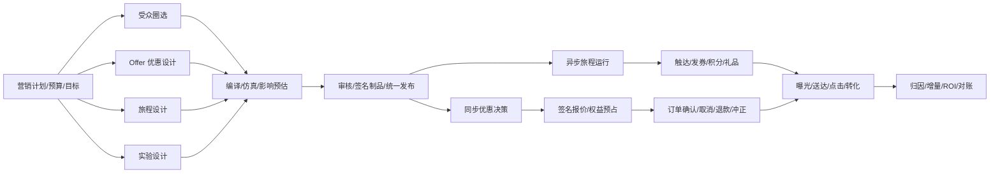
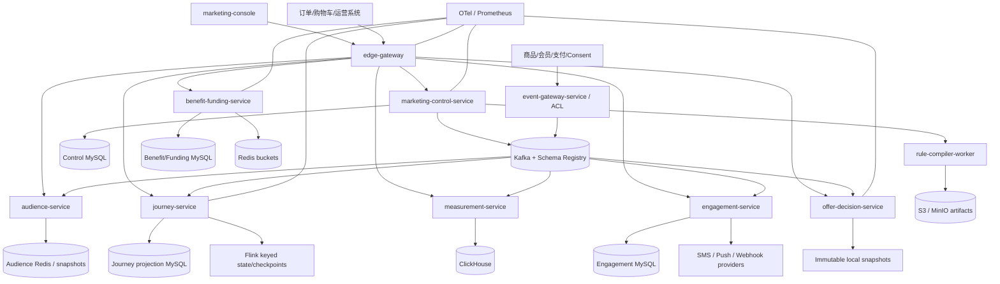

# 营销低代码平台完整一期交付方案（R1）

## Requirement

从零建设一套面向现代零售电商、参考京东式平台业务复杂度的营销低代码系统。R1 同一次交付必须包含：营销计划与活动、优惠决策、受众、人群计算、权益与资金、事件接入、用户旅程、渠道触达、实验、衡量归因、运营管理端、规则引擎、生产部署与治理。系统采用 Java 21、DDD、微服务、事件驱动和控制面/运行面分离架构。

“一期完整、不分期”的执行定义：

- 只有一个批准范围、一个最终可运行版本、一个最终验收门；核心能力不写“二期再做”。
- 工程实现仍必须按依赖顺序施工并逐项测试，这只是内部工作包，不形成产品分期。
- 外部商品、订单、支付、会员主数据和真实短信/Push 商业账号不凭空重造；R1 交付版本化契约、防腐层、沙箱和参考连接器。
- “生产级”表示设计和代码具备安全、隔离、一致性、审计、可观测、部署、回滚、容量与故障验证门禁；在真实生产环境尚未完成压测、灾备和合规评审前，不虚称已经达到京东真实流量规模。

本方案完整替代 `docs/delivery/marketing-lowcode-foundation/DELIVERY_PLAN.md`。旧方案被拒绝的证据见 [ADVERSARIAL_DESIGN_REVIEW.md](ADVERSARIAL_DESIGN_REVIEW.md)。

## Repository Evidence

- `marketing-lowcode-platform/` 是绿地目录，没有需要兼容的业务代码、数据库或已部署 API。
- 用户明确要求不参考工作区其他项目的业务和实现。
- 目标目录当前不是 Git 仓库，没有 CI provider；R1 先提供 provider-neutral 验证脚本，默认附 GitHub Actions，切换 GitLab/Jenkins 不改变底层命令。
- 截至 2026-09-02，Spring 官方兼容矩阵显示 Spring Cloud 2025.1.x 对应 Spring Boot 4.0/4.1，并建议使用 release-train BOM：[Spring Cloud](https://spring.io/projects/spring-cloud/)。Spring Boot 4.1.1 支持 Java 17–26，Java 21 LTS 在支持范围内：[System Requirements](https://docs.spring.io/spring-boot/system-requirements.html)。
- Apache KIE 10.2 提供 Drools、DMN 和 Rule Unit；官方推荐云原生/微服务使用 Rule Unit 和 executable model，DMN 决策表具备 hit policy 和静态分析能力：[Drools 10.2](https://kie.apache.org/docs/10.2.x/drools/drools/getting-started/index.html)、[DMN](https://kie.apache.org/drools/dmn/)。
- Flink `ProcessFunction` 提供 keyed state 与 event/processing-time timer，checkpoint/savepoint 可恢复状态；但官方也明确指出，端到端 exactly-once 仍要求可重放 source 与事务型或幂等 sink，因此触达和发券必须继续实现幂等：[Process Function](https://nightlies.apache.org/flink/flink-docs-release-2.2/docs/dev/datastream/operators/process_function/)、[Stateful Stream Processing](https://nightlies.apache.org/flink/flink-docs-release-2.1/docs/concepts/stateful-stream-processing/)。
- React Flow 提供节点、连线、缩放、MiniMap 和键盘交互基础，适合作为低代码画布底座：[React Flow](https://reactflow.dev/)。
- Debezium 官方 outbox 模式用于避免业务状态和跨服务事件不一致：[Outbox Event Router](https://debezium.io/documentation/reference/stable/transformations/outbox-event-router.html)。
- REST 错误采用 RFC 9457 Problem Details；异步契约采用 AsyncAPI 3 和 CloudEvents envelope：[RFC 9457](https://www.rfc-editor.org/rfc/rfc9457.html)、[AsyncAPI 3](https://www.asyncapi.com/docs/reference/specification/v3.0.0)、[CloudEvents](https://cloudevents.io/)。
- 中国《个人信息保护法》第二十四条要求自动化决策透明、公平，商业营销提供不针对个人特征的选项或便捷拒绝方式；促销规则、期限、适用范围和价格基准也需清晰公示。本系统把这些转成产品字段和发布门禁，但最终合规结论仍需法律/合规人员确认：[个人信息保护法](https://www.npc.gov.cn/npc/c2/c30834/202108/t20210820_313088.html)、[规范促销行为暂行规定](https://www.samr.gov.cn/zw/zfxxgk/fdzdgknr/fgs/art/2023/art_cae53a080be2401e8f91c6d6291539f8.html)、[互联网平台价格行为规则](https://www.samr.gov.cn/zw/zfxxgk/fdzdgknr/jjjzs/art/2025/art_eef66659c9624c5091bd3acd050b1710.html)。

## Feasibility

- Code delivery verdict: **go**。
- Production go-live verdict: **conditional-go**；所有 Production Admission Gates 取得真实证据后才能上线。
- Constraints:
  - 服务端、领域、规则编译和流处理均使用 Java 21；浏览器端使用 React + TypeScript，不使用 Java/Vaadin。
  - R1 是领域型营销低代码平台，不是任意表单/数据库/页面都能搭建的通用 Low-Code PaaS。
  - 同步优惠决策与异步旅程同批交付但运行时隔离。
  - 所有外部副作用以幂等/可补偿语义实现，不宣传跨 MySQL、Kafka、Redis、渠道供应商的虚假分布式 exactly-once。
- Runtime dependencies:
  - MySQL 8.4 LTS：各上下文 OLTP 和权威账本。
  - Kafka 4.x/KRaft：业务事件、命令和发布通知。
  - Redis：受众索引、幂等加速、频控、热点库存 bucket；Redis 不是最终资金账本。
  - S3-compatible storage：签名规则制品、ReleaseManifest、审计冷存、Flink checkpoint/savepoint；本地 MinIO。
  - ClickHouse：决策、曝光、触达、转化、归因和审计查询投影。
  - Flink 2.2.x：受众增量计算、旅程 keyed state/timer、衡量流处理。
  - OIDC IdP、OpenTelemetry Collector、Prometheus/Grafana；本地提供可替换开发配置。

## Product Design

### Product boundary

R1 交付一个“从策略到结果”的完整闭环：



### Actors and jobs

| Actor | Primary jobs | Separation / permission |
| --- | --- | --- |
| 平台营销运营 | 建计划、活动、Offer、旅程、实验，做仿真和影响预估 | edit/submit，不能审核自己的版本 |
| 商家/品牌运营 | 选择参与范围、出资比例、门店/商品、查看效果 | 仅本组织资源；必须显式 opt-in 平台联合促销 |
| 审核/合规 | 审规则、资金风险、消费者条款、个性化与人群合规 | review；风险等级决定多级审批 |
| 发布经理/SRE | 预热、灰度、推进、暂停、回滚、game day | release/kill-switch；不改业务内容 |
| 策略研发 | 注册字段、节点、算子、编译插件和金标 | schema/plugin admin；插件走供应链门禁 |
| 客服/审计 | 按 requestId/orderId 查询价格、权益和触达轨迹 | 脱敏只读、有目的限制和访问审计 |
| 数据分析 | 定义指标/归因窗，查看实验、ROI、漏斗 | aggregate analytics；原始 PII 默认不可见 |
| 订单/购物车/频道 | evaluate、创建 PromotionApplication、confirm/cancel/refund | service identity + contract |

### Ubiquitous language

- **MarketingPlan**：目标、负责人、总预算引用和多 Campaign 的业务计划。
- **Campaign**：协调 Audience、Offer、Journey、Experiment 和 Activation 的稳定业务身份，不持有所有大图内容。
- **OfferVersion**：一次不可变的优惠命题，包括作用域、资格、价格/权益、叠加和消费者条款。
- **AudienceSegmentVersion**：可复现的人群表达式及其数据来源、新鲜度和快照版本。
- **JourneyVersion**：事件/定时驱动的状态机定义。
- **ExperimentVersion**：随机化单位、层、变体、holdout 和分流比例。
- **DefinitionVersion**：可提交审核的配置版本；发布后不原地修改。
- **ArtifactBundle**：编译后的 engine-specific、不可变、签名运行物及所有固定依赖。
- **ReleaseBundle**：一个激活单元中 Offer/Audience/Journey/Experiment/Template 的完整依赖闭包。
- **ReleaseManifest**：某 tenant/cell/runtime/namespace 期望状态、代际、签名和 rollout policy。
- **OfferToken**：Decision 产生的短期签名报价，绑定订单上下文与制品代际。
- **PromotionApplication**：把一个有效 OfferToken 应用到业务订单的有状态记录。
- **ReservationGroup**：一次订单中多个预算、库存、券和权益的原子预占边界。
- **FundingShare**：平台、商家、品牌等出资方对优惠金额的责任分摊。
- **JourneyEnrollment**：一个主体进入固定 JourneyVersion 后的持久状态。
- **ContactAttempt**：一次渠道触达命令、供应商调用和回执的幂等实体。
- **Exposure/Conversion**：实际展示/生效和目标行为事实；仅配置或被分组不等于曝光。

### Capability map — all included in R1

| Domain | Complete R1 capability |
| --- | --- |
| Campaign governance | 计划、活动、日历、目标、负责人、预算引用、商家参与、草稿/版本/diff、风险分级、多级审批、定时发布、暂停、终止、复制和环境晋级 |
| Domain low-code | Offer 决策画布、Audience 表达式、Journey 状态机、DMN 决策表、Benefit/Prize 配置；节点注册表、schema-driven form、模板、子图、lint、undo/redo、编辑租约、评论、导入导出 |
| Rule management | 字段/算子/函数/节点版本、静态类型、null/missing 语义、复杂度预算、仿真、金标、历史回放、差分测试、编译报告、制品签名和 ABI 兼容 |
| Promotion decision | 商品/店铺/商家/类目/渠道/地域/会员/人群/订单资格，分层价格计算、兼容/互斥/择优、封顶、行级分摊、解释、批量决策 |
| Playbooks | 直降、一口价、会员价、满减、每满减、阶梯、折扣封顶、N 件 N 折、N 元任选、套装、赠品、加价购、免邮、商品/店铺/平台/运费券、积分/红包/返现、抽奖资格 |
| Benefit & funding | 权益定义、券模板/实例/钱包、预算、资金出资、库存/区域 escrow/bucket、奖池、领取/锁定/核销/释放/过期、确认、取消、部分退款、冲正、赠品追回、对账 |
| Audience | 标签/字段字典、名单导入、规则圈选、人数预估、批量快照、实时增量、membership 查询、版本/水位/新鲜度、导出审批、隐私删除/匿名化 |
| Event gateway | OpenAPI/AsyncAPI 契约、鉴权、schema 校验、去重、event time/watermark、乱序与迟到、限流、隔离、replay 和 quarantine |
| Journey | 事件/定时/人群触发、条件、分支、并行、等待到时、等待事件、A/B/holdout、频控、Grant、Send、Webhook、目标、退出、bounded repeat、版本固定和显式迁移 |
| Engagement | Consent/Suppression、退订、静默时段、频控、模板版本、变量校验、渠道路由、供应商限流/熔断/重试、沙箱、HTTP/Webhook 参考连接器、回执和 DLQ |
| Experiment | 稳定 hash、randomization unit、mutual-exclusion layer、变体、holdout、流量调整版本、真实 exposure、SRM 检测和 kill switch |
| Measurement | 曝光/报价/应用/发放/送达/点击/订单/退款事实，去重、漏斗、转化窗口、last/first/touch 归因、实验增量、成本/补贴/ROI、资金核对、迟到重算 |
| Operations | OIDC/多租户/cell、审计、指标/日志/trace、告警、备份/PITR、跨 AZ、多地域设计、容量/soak/burst/chaos、Helm、SBOM、漏洞扫描、runbooks |

### Explicit external boundaries (not deferred internal phases)

- 不自建商品、订单、支付、会员主数据；交付版本化 contract、ACL adapter、simulator 和 contract tests。
- 不实现广告实时竞价、搜索、推荐和 ML 自动预算优化。
- 不代替企业财务总账、支付清算和发票系统；必须输出资金分摊、确认、退款和冲正事件供对账。
- 不包含真实短信/Push 供应商账号；交付 provider SPI、sandbox 和至少一个签名 HTTP/Webhook connector。
- 不在本地机器伪造跨地域 active-active 证据；交付 cell/Helm/IaC 设计及可执行演练脚本，真实环境演练是上线门禁。

### Core business invariants

1. 金额只使用 `Money(currency, minorUnits: long)`；比例用 basis points；任何计算禁止 `double`。
2. 所有计算显式固定 `occurredAt`、时区、locale、Unicode normalization、舍入模式和规则代际；不得在领域算法中随意读取系统时间。
3. 价格 stage 固定为 `BASE -> ITEM -> SHOP -> CROSS_SHOP -> PLATFORM -> COUPON -> SHIPPING -> PAYMENT_DISPLAY`；可配置的是组内策略和兼容性，不允许任意改写 stage 顺序。
4. 任一 stage 后商品应付不小于允许的价格下限；订单优惠等于所有行优惠分摊之和，使用确定性 largest-remainder 算法处理余数。
5. 同组 hit policy 限于 `FIRST/BEST/SUM/MAX_N/DMN_POLICY`；任意冲突图必须在编译期证明候选上限和求解 deadline，超限拒绝发布，不用不透明近似算法少给已承诺优惠。
6. 决策是无副作用报价；只有 Benefit/Funding 的 PromotionApplication 可以改变预算、库存、券和权益状态。
7. OfferToken 绑定 tenant、subject、order/cart digest、quoteId、generation、artifact/benefit versions、金额、币种、数量、expiry、nonce，并由 KMS 非对称签名；篡改、过期、跨租户和重放必须失败。
8. ReservationGroup 默认全成全败；允许部分成功必须由 Offer 明确声明，返回精确 applied/rejected lines 和补偿状态。
9. `available + reserved + consumed + returned + expired` 按资源定义满足守恒；每个状态变更都有双录流水、fencing token 和可重放 commandId。
10. Published 配置不可覆盖；修订产生新 DefinitionVersion，当前实例仍固定旧版本，除非通过显式迁移。
11. ReleaseManifest 是 desired state；Kafka 只负责通知。新实例即使错过 Kafka retention，也必须能从 Manifest + artifact store 冷启动。
12. 未 ACK/未预热 runtime 不接新代际流量；同一主体用稳定 hash 固定 stable/canary/variant，OfferToken 固定后不受换 Pod 和后续发布影响。
13. Audience 字段具有 provenance、asOf、maxAge、missing policy 和 sensitivity；调用方自报高风险标签不被信任。
14. Journey 外部副作用以 `enrollmentId + nodeExecutionId + attemptPurpose` 幂等；状态恢复、消息重复、乱序或 timer 重放不能重复发券/触达。
15. Consent、suppression、未成年人策略、quiet hours 和 frequency cap 必须在实际发送/发放前重新检查，不能只在入群时检查。
16. Experiment 分组不等于 exposure；只有用户实际看到 Offer/Contact 后才产生 exposure，holdout 永不执行活动动作。
17. 促销期限、范围、限制、价格基准、计算方式、个性化标识和出资责任形成不可变 TermsSnapshot，可关联每次决策和展示。
18. 个性化营销必须支持通用非个性化路径、便捷退出和可解释 reason；公平性检查进入发布门禁。
19. 所有外部命令的 Idempotency-Key 必须绑定 payload hash 和原始响应；同 key 不同 payload 返回 409。
20. 紧急 kill switch 只能收紧/关闭行为，不能绕过审批增加权益；它使用独立高优先级传播通道并完整审计。

## Acceptance Criteria

| ID | Observable behavior | Priority | Verification |
| --- | --- | --- | --- |
| AC-01 | 一条文档化命令可启动完整本地栈：UI、Gateway、9 个领域 deployable、3 个 Flink job 及依赖；所有 health/readiness 通过 | P0 | full Compose smoke |
| AC-02 | Java 模块满足 DDD 依赖方向；服务不共享领域/JPA 类型、不跨库访问；外部模型只经 ACL | P0 | ArchUnit + dependency guards |
| AC-03 | OIDC/JWT、service identity、RBAC/ABAC 和 hierarchical tenant/org/shop scope 生效，任何 HTTP、SQL、cache、Kafka、S3、后台任务和批量路径不能跨租户 | P0 | tenant escape suite |
| AC-04 | 用户能在统一工作台建立含多个 Offer、Audience、Journey、Experiment 和 Activation 的 Campaign，并由一个 ReleaseBundle 可见发布 | P0 | end-to-end UI/API |
| AC-05 | Offer、Audience、Journey、DMN 四种语义设计器及 Benefit/Funding 编辑器由版本化 Schema/Definition 驱动，支持适用的模板、子图、diff、评论、租约和冲突恢复 | P0 | UI component + E2E |
| AC-06 | 方言隔离：Decision 图含 Wait/Send 或环时报错；Journey 图含直接价格 RHS/无限循环时报错；节点错误能定位画布 | P0 | compiler negative golden set |
| AC-07 | 字段/节点/plugin 具有 semantic version、ABI、null/missing、cost、side-effect 和 migrator；无迁移器不得静默改变旧语义 | P0 | compatibility/property tests |
| AC-08 | 编译器在无网络、CPU/内存/时间/文件限制的 worker 中产生签名 ArtifactBundle；规则炸弹、外部 schema 引用和篡改资产被拒绝 | P0 | sandbox/fuzz/security tests |
| AC-09 | DMN 表可检查 gap/overlap/hit policy；Drools 只执行受控条件/推理，Money/optimizer/allocator 均为纯 Java 且通过金标 | P0 | DMN analysis + rule golden set |
| AC-10 | 用户可对草稿做单例仿真、批量样例、线上版本对比、历史事件回放和成本/人群影响预估，结果显示完整版本与新鲜度 | P0 | simulation/backtest E2E |
| AC-11 | 风险分级、多级审批、提交人自审阻断、商家 opt-in、消费者 TermsSnapshot 和合规检查全部在发布前可观察 | P0 | workflow/security E2E |
| AC-12 | 发布使用签名 ReleaseManifest；制品区域复制、runtime 预热和 ACK 达到策略后才激活；失败显示 partial state 而非伪成功 | P0 | multi-instance release tests |
| AC-13 | stable/canary/多个保留代际同时存在；稳定 hash 跨 Pod 不漂移；支持定时激活、推进、暂停、任意保留代际回滚和独立 kill switch | P0 | rollout/rollback chaos tests |
| AC-14 | Kafka 通知重复、乱序、gap、rebalance 或丢失时 runtime 最终与 Manifest desired state 收敛；超 retention 新实例仍可冷启动 | P0 | Toxiproxy/Testcontainers + reconcile |
| AC-15 | Decision evaluate 无控制库和同步画像调用；相同规范输入/版本结果逐字节稳定，并返回 generation、artifact、reason 和 trace handle | P0 | architecture guard + determinism tests |
| AC-16 | 同一购物车可正确处理 item/shop/cross-shop/platform/coupon/shipping 层级优惠、兼容矩阵、择优、封顶和稳定 tie-break | P0 | pricing golden matrix |
| AC-17 | 行级分摊和 FundingShare 总和严格守恒；百行购物车、零价、边界金额、不同币种和余数场景正确 | P0 | jqwik property + mutation tests |
| AC-18 | OfferToken 绑定上下文、代际、金额和有效期并验签；修改任何字段、跨租户、过期或 nonce 重放均拒绝 | P0 | cryptographic contract tests |
| AC-19 | `evaluate -> apply/reserve -> confirm/cancel/expire/refund/reverse` 闭环可运行；reserve 失败返回机器可处理的 `REPRICE_REQUIRED`，不能形成价格成功权益失败状态 | P0 | checkout lifecycle E2E |
| AC-20 | 多权益 ReservationGroup 默认全成全败；显式 partial policy、超时、崩溃和补偿有确定结果 | P0 | saga/fault-injection tests |
| AC-21 | 券支持领取、锁定、核销、解锁、过期、作废和退款返还；重复订单/回调不重复核销 | P0 | coupon lifecycle/concurrency |
| AC-22 | 预算、资金、赠品库存、奖池和区域 escrow/bucket 在并发下不超发/超预算，流水恒等式零违反 | P0 | million-command model/history check |
| AC-23 | 平台/商家/品牌 FundingShare、成本中心、部分退款、冲正和赠品追回形成可对账事实 | P0 | ledger reconciliation E2E |
| AC-24 | Audience 支持规则圈选、名单导入、preview count、批量 snapshot、实时更新和 membership lookup；版本/水位/过期可见 | P0 | batch/stream/integration tests |
| AC-25 | 同一 AudienceSnapshot 被 Decision 和 Journey 引用；陈旧数据按字段策略阻断或使用明确降级，决策不信任伪造标签 | P0 | freshness/provenance tests |
| AC-26 | Event Gateway 对 schema、身份、eventId、event time、tenant、限流和大小做验证；重复、迟到、乱序、quarantine 和 replay 可测试 | P0 | event contract/chaos tests |
| AC-27 | Journey 支持所有声明节点；进程 kill、checkpoint 恢复、重复/乱序事件后 Wait 可恢复，同一事件只创建一个 Enrollment | P0 | Flink savepoint/recovery E2E |
| AC-28 | JourneyVersion 固定；新版本只影响新 enrollment，显式迁移有 dry-run、兼容检查、审计和失败回滚 | P0 | mixed-version migration tests |
| AC-29 | 无同意、suppression、未成年人限制、quiet hours、超频控或重复 contact key 时不触达；发送前再次校验 | P0 | compliance/contact policy E2E |
| AC-30 | Engagement 的 sandbox 和 HTTP/Webhook connector 支持模板变量校验、签名、供应商 429/5xx/timeout、限流、重试、回执去重和 DLQ | P0 | WireMock/provider fault tests |
| AC-31 | Experiment 使用稳定 randomization、mutual-exclusion layer、variant/holdout；只有实际动作产生 exposure，SRM 异常可报警/暂停 | P0 | distribution/property/E2E |
| AC-32 | Exposure、Decision、Application、Grant、Contact、Conversion、Refund 事件重复或迟到时，指标不重计且归因可重算 | P0 | replay/idempotent projection tests |
| AC-33 | 控制台展示漏斗、转化、增量、补贴成本、ROI、出资分摊和对账差异；查询标明数据水位/延迟 | P1 | ClickHouse query + UI E2E |
| AC-34 | 客服按 requestId/orderId 查询脱敏 DecisionTrace、候选拒绝、金额步骤、Terms 和权益/触达状态；越权、TTL、匿名化和 legal hold 生效 | P0 | query/privacy tests |
| AC-35 | 个性化路径有非个性化选项、退出和说明；不合理差别价格、公示缺失、商家未同意出资会阻断发布 | P0 | policy-as-code tests + compliance review |
| AC-36 | Metrics/log/trace 有基数和吞吐预算；Collector/Exporter 阻塞不会阻塞决策线程，drop/sampling 可观察 | P0 | telemetry stress/failure tests |
| AC-37 | noisy tenant 达到配额时不拖慢其他 cell/tenant；线程池、队列、cache、Kafka partition 和 rate limit 均隔舱 | P0 | noisy-neighbor load test |
| AC-38 | API/Event/DSL/Artifact/DB 支持 N/N-1，混合版本滚动升级、expand-contract 和应用/规则回滚无错误结果 | P0 | consumer-driven + mixed-version tests |
| AC-39 | MySQL、Redis、Kafka、S3、ClickHouse、Flink、IdP 单独及关键组合故障具有明确行为且恢复后自动对账/收敛 | P0 | automated chaos matrix |
| AC-40 | 多 AZ 和区域 DR 演练满足 RPO/RTO；Benefit 不出现 split-brain 双花，Journey 从 checkpoint/savepoint 恢复 | P0 | restore/failover game day |
| AC-41 | 固定硬件/数据集下完成 4h peak soak、5min 3× burst、cold start、发布风暴；开启真实遥测后满足各 SLO | P0 | performance report |
| AC-42 | DSL/资金/定价通过 example、property、metamorphic、fuzz、mutation 和 shadow differential tests | P0 | quality reports and corpus |
| AC-43 | 完整 CI 执行 backend/frontend/Flink、contract、integration、E2E、image、SBOM、SAST/DAST、secret/license/vulnerability scan | P0 | local parity + CI result |
| AC-44 | 架构、领域、API、DSL、数据、合规、安全、容量、发布、回滚、灾备、对账、DLQ、密钥轮换和插件开发文档与代码一致 | P1 | documentation verification |

## UI/UX Design

### Information architecture

```text
营销指挥台
├── 总览：目标、预算、在线活动、旅程吞吐、风险、告警、数据水位
├── 计划与活动
│   ├── MarketingPlan / Campaign / 日历
│   ├── Offer 设计器 / 仿真 / 历史回放
│   ├── Journey 设计器 / 实例监控
│   └── Experiment / 变体 / Holdout
├── 营销资产
│   ├── Audience / 标签 / 名单 / 快照
│   ├── Benefit / 券 / 库存 / 奖池 / Funding
│   ├── 消息模板 / 渠道 / Consent / Suppression
│   └── 模板库 / 子图 / 字段与节点注册表
├── 治理与发布
│   ├── 我的草稿 / 审核队列 / 风险报告
│   ├── ReleaseBundle / Cell readiness / 灰度 / 回滚
│   └── Kill switch / 变更审计
├── 运营与客服
│   ├── Decision / PromotionApplication / Grant 查询
│   ├── Journey Enrollment / ContactAttempt / DLQ
│   └── 对账 / 异常修复
└── 衡量分析
    ├── 漏斗 / 转化 / 归因 / ROI
    ├── 实验 / SRM / 增量
    └── 资金分摊 / 退款 / 差异
```

### Designer family

不使用一张“万能画布”，而是共享交互内核、采用不同语义方言：

1. **Offer Designer**：无环、无等待、无副作用；左侧节点库，中部决策 DAG，右侧属性/Terms/资金，底部 lint/仿真/解释。
2. **Audience Builder**：条件树、集合运算、标签来源和 as-of/freshness；并列展示人数预估、抽样和隐私等级。
3. **Journey Designer**：事件/定时触发、分支、并行、等待、A/B、Send/Grant/Webhook、目标/退出、受限重复；展示每节点幂等键和失败策略。
4. **DMN Decision Table**：列类型、allowed values、hit policy、gap/overlap 分析和测试行。
5. **Benefit/Funding Editor**：券/权益状态、库存 bucket、区域 escrow、出资分摊、退款与追回策略，不伪装成图。

### Offer designer wireframe

```text
┌ 活动：双11家电主会场  Draft v8  [保存] [校验] [仿真] [提交] ┐
│ 节点/模板 │              Offer 决策画布                │ 属性/条款 │
│ Scope     │ [Start]→[家电类目]→[PLUS会员]─matched─┐   │ 字段来源  │
│ Condition │                                        ├→[满500减80]│
│ Benefit   │ [平台券]──────── compatible ──────────┘   │ 出资/封顶  │
│ Policy    │ MiniMap · Zoom · Fit · Undo · Redo        │ 公示文案  │
├───────────┴────────────────────────────────────────────┴──────────┤
│ Problems 2 · Cost 68/100 · Audience 1.2M(asOf 10:30) · Sample 98% │
└───────────────────────────────────────────────────────────────────┘
```

### Journey designer wireframe

```text
┌ 旅程：加购未支付召回  Published v3 / Draft v4 [实例监控] [提交] ┐
│ [CartAdded] → [Wait 30m] → [No Order?] ─yes→ [Consent/Freq]     │
│                                  │ no       ├→ [发券] → [Push]   │
│                                  └────────→ [Goal: Paid]         │
│ 右栏：event-time/late policy、timer、retry、idempotency、exit TTL │
└───────────────────────────────────────────────────────────────────┘
```

### Interaction and state rules

- Node Definition 的 `configSchema + uiSchema` 驱动属性表单，前端不得维护第二套字段/算子真值。
- 连接时先做端口/类型/方言即时检查；服务端仍重新验证，不信任前端。
- Undo/redo 在本地命令栈完成；自动保存只保存 draft；编辑租约避免多人同时写，评论和 presence 不改变配置。
- 乐观冲突不自动覆盖：停止自动保存，显示 canonical diff，允许重新加载、复制本地 JSON 或基于新版本重放操作。
- 仿真明确区分“不命中”“字段缺失”“Audience 陈旧”“runtime 不可达”“Benefit 不足”和“编译错误”。
- 发布屏展示每个 region/cell/runtime 的复制、验签、预热、ACK、generation 和流量，而不是单一绿色按钮。
- 高风险操作二次确认需展示作用对象、当前代际、预计人群/资金、回滚目标和审批号。
- 客服轨迹默认脱敏；查看更敏感字段需 purpose、额外权限和审计，不提供任意原始上下文下载。

### State matrix

| State | Behavior |
| --- | --- |
| Loading | Skeleton；画布只读；保留上次本地未提交操作但不自动发送 |
| Empty | 按业务目标推荐模板；允许空白创建；明确每种方言用途 |
| Partial data | 显示具体数据水位与缺失模块，不把旧人群/旧报表当实时 |
| Validation error | 节点红框 + 问题列表 + JSON Pointer；点击定位；用户输入不丢失 |
| Permission denied | 展示缺失权限/审批角色，不降级到 header 或匿名写入 |
| Conflict | 展示本地/服务端版本和 diff；无“强制保存覆盖”捷径 |
| Publish partial | 按 cell 列出未 ready 原因；未满足 policy 时不能显示 ACTIVE |
| Runtime failure | 与业务 no-match 分开；给稳定 problem code 和 retryability |
| Success | 显示不可变 version/artifact/release/generation，可直接进入验证或追踪 |

### Responsive and accessibility

- ≥1440px 三栏；1024–1439px 可折叠节点库/检查器；768–1023px 抽屉；手机仅支持监控、审核、暂停和查询，不承诺复杂拖拽。
- 节点/边 Tab 可达，Enter/Space 选择，方向键移动，Delete 删除；所有画布动作有 toolbar 等价入口。
- 状态不只依赖颜色；错误和字段用 `aria-describedby`；modal/side panel 正确管理焦点；图提供可读的线性大纲模式。
- 数字、金额、时区和语言本地化；保存到 UTC Instant，业务日历显式 IANA timezone。
- Playwright + axe 覆盖关键路径，目标 WCAG 2.2 AA 可操作项。

## Technical Solution

### Architecture options

| Option | Physical topology | Advantages | Costs and risks | Decision |
| --- | --- | --- | --- | --- |
| 粗粒度 5–6 服务 | Control、Decision、Audience+Benefit、Journey+Engagement、Measurement、Gateway | 最少运维、容易演示 | 资金、扫描、计时器和供应商故障相互污染 | Rejected |
| **平衡型 9 个领域 deployable** | Control、Compiler、Audience、Decision、Benefit/Funding、Event Gateway、Journey、Engagement、Measurement，外加 Gateway/UI | 同步/异步/资金/触达/分析故障域独立，仍可单仓统一交付 | 契约、部署和集成测试较多 | **Selected** |
| 12–15 个细粒度服务 | 每个逻辑 context 单独服务 | 最大自治和团队隔离 | 绿地一次交付会形成大量空壳与分布式 CRUD | Rejected now |

### C4 container view



### Logical bounded contexts and physical ownership

| Bounded context | Core model | Physical owner | Consistency boundary |
| --- | --- | --- | --- |
| Campaign Governance | MarketingPlan, Campaign, ApprovalCase, TermsSnapshot | Control | Single aggregate/version transaction |
| Offer & Low-code Design | OfferVersion, DecisionGraph, DecisionTable, Template, NodeDefinition | Control | Version freeze; no runtime execution |
| Experiment Definition | ExperimentVersion, Layer, Variant, Holdout | Control | Versioned config; assignment compiled |
| Release Management | ReleaseBundle, ReleaseManifest, ActivationRecord, RuntimeAck | Control | Desired-state CAS per tenant/cell/runtime/namespace |
| Rule Build | CompilationRequest/Report, ArtifactBundle metadata | Compiler | Stateless isolated build; immutable outputs |
| Audience & Feature | SegmentDefinition, AudienceSnapshot, Membership projection | Audience | Definition ACID; membership partition/projection |
| Real-time Decision | CandidateIndex, Eligibility, PricingPlan, Optimizer, Allocator | Decision | Request-scoped immutable generation; no OLTP aggregate |
| Promotion Fulfillment | PromotionApplication, ReservationGroup, BudgetAccount, InventoryPool/Bucket, CouponInstance, PrizePool, FundingLedger | Benefit/Funding | Tenant/home-region shard transaction + fenced resource operations |
| Event Intake | SourceRegistration, EventReceipt, QuarantineRecord | Event Gateway | Inbox/dedup per source/event |
| Journey Orchestration | JourneyPlan, JourneyEnrollment, StepExecution, TimerReference | Journey/Flink | Keyed subject+journey state/checkpoint |
| Contact Policy & Delivery | ConsentProjection, Suppression, FrequencyBucket, TemplateVersion, ContactAttempt | Engagement | Send-time policy + idempotent attempt |
| Measurement & Audit | AttributionPolicy, MetricDefinition, immutable fact/projection | Measurement | Event-time projection; recomputable |

`Experiment Assignment` 是编译后的纯函数能力，被 Decision/Journey 运行时加载；定义仍由 Experiment context 所有。`Consent` 的法律真值可以来自外部系统，Engagement 只持版本化投影并在发送前校验。高基数 Decision/Exposure/Membership 是分区事实或投影，不强行包装成 DDD aggregate。

### Context map

```text
Catalog / Customer / Order / Payment / Consent (external upstream)
             │ Published Language + ACL through Event Gateway
             ▼
Audience ──versioned snapshot/index──▶ Decision ──signed OfferToken──▶ Benefit/Funding
   │                                      │                              ▲
   └──membership change──────────────▶ Journey ──idempotent Grant────────┤
                                          │
                                          └──ContactCommand──▶ Engagement ──ACL──▶ Providers

Control ──signed Decision Artifact/Manifest──▶ Decision
Control ──signed Journey Artifact/Manifest───▶ Journey
Control ──signed Audience Plan───────────────▶ Audience

Decision / Benefit / Journey / Engagement / Commerce facts ──▶ Measurement
```

### Service package rules

每个 Spring Boot 服务采用 hexagonal dependency direction：

```text
com.acme.marketing.<context>
├── domain/
│   ├── model/          # aggregate/entity/value object/domain event
│   ├── policy/         # pure domain services
│   └── port/           # repository, clock, signer, publisher abstractions
├── application/
│   ├── command/        # use cases and transaction boundaries
│   ├── query/          # query use cases/read models
│   └── contract/       # application DTO mapping only
└── adapter/
    ├── in/web|kafka|job
    └── out/persistence|kafka|redis|objectstore|provider
```

- `domain` 不 import Spring/JPA/Kafka/Redis/HTTP/Flink。
- Controller 不直接调用 Repository；adapter DTO 不进入 domain。
- `platform-common` 只放 Money 以外的技术 primitives（ID、Problem、event envelope、test fixtures）；Money 等业务值对象由对应 context 所有并经 contract 显式转换。
- `marketing-contracts` 只保存 OpenAPI/AsyncAPI/Avro/JSON Schema 和生成类型；禁止共享 entity/repository。
- 架构规则由 ArchUnit 和 Maven module dependency graph 强制。

### Aggregate boundaries

| Aggregate / model | Invariants |
| --- | --- |
| Campaign | 只管理身份、目标、负责人、component version refs 和 activation；不内嵌历史大图 |
| DefinitionVersion | 草稿可编辑；submitted 后冻结 hash；published 永不覆盖 |
| ApprovalCase | 风险策略决定 steps；actor 不能批准自己提交的 step；决定绑定 definition hash |
| ReleaseBundle | 引用全部已批准、已编译的精确版本；dependency closure 和 Terms 完整才可 stage |
| ReleaseSlot | key=`tenant+cell+runtime+namespace`；代际 CAS；stable/canary/retained 多槽，不是全局大根 |
| AudienceSnapshot | 不持有海量 membership；只记录 snapshot/version/watermark/checksum/location/freshness |
| PromotionApplication | 绑定 OfferToken/业务订单；状态 `PENDING→RESERVED→CONFIRMED|CANCELLED|EXPIRED→PARTIALLY_REVERSED|REVERSED` |
| ReservationGroup | 记录每个 resource reservation 和 compensation；默认 atomic policy |
| CouponInstance | `AVAILABLE→LOCKED→REDEEMED`，以及 UNLOCK/EXPIRE/VOID/RETURN 的合法边 |
| Budget/Inventory bucket | fencing epoch、available/reserved/consumed/returned；任何变化有 immutable ledger line |
| JourneyEnrollment | 固定 JourneyVersion、current tokens/steps/timers/TTL；按 subject+journey 分区 |
| ContactAttempt | 唯一 contactKey、templateVersion、consentVersion、provider request/receipt；重试不新建业务效果 |

### Low-code language system

共享的只是类型/表达式/资产引用/版本 envelope，不共享一个通用执行器：

| Dialect | Runtime semantics | Allowed | Forbidden | Target artifact |
| --- | --- | --- | --- | --- |
| `OFFER_DECISION_DAG` | 请求内、无状态、确定性、严格 deadline | scope/filter/decision table/benefit candidate/stack policy | wait、I/O、side effect、cycle | DecisionPlan + DMN/Drools model + Java calculator refs |
| `AUDIENCE_EXPRESSION` | 集合/流式 predicate，可重算 | tag/profile/event aggregate/set algebra | 发权益、触达、任意脚本 | SegmentPlan + batch/stream operator plan |
| `JOURNEY_STATE_MACHINE` | 跨事件持久状态、timer、幂等效果 | trigger/wait/split/parallel/AB/send/grant/webhook/goal/bounded-repeat | 直接改订单价、无限 loop、未声明副作用 | JourneyPlan interpreted by generic Flink runtime |
| `DMN_DECISION_TABLE` | 标准 typed decision/hit policy | FEEL allowlist、table、context | Java class/import、外部 I/O | Validated DMN asset |
| `BENEFIT_POLICY` | 有状态资源与资金策略 | quota/refund/funding/expiry/draw config | 任意代码和跨服务事务脚本 | BenefitPolicy snapshot |

Node Definition contract 至少包含：

```json
{
  "stableTypeId": "condition.order-amount",
  "semanticVersion": "2.1.0",
  "dialects": ["OFFER_DECISION_DAG"],
  "runtimeTarget": "decision-abi-1",
  "inputPorts": [{"name":"in","type":"Flow"}],
  "outputPorts": [{"name":"matched","type":"Flow"},{"name":"unmatched","type":"Flow"}],
  "configSchemaRef": "sha256:...",
  "uiSchemaRef": "sha256:...",
  "nullSemantics": "NO_MATCH",
  "missingSemantics": "ERROR_REQUIRED_FIELD",
  "sideEffect": "NONE",
  "costWeight": 2,
  "requiredFields": [{"path":"order.total","maxAge":"PT0S","trust":"SIGNED_INPUT"}],
  "compilerPluginDigest": "sha256:...",
  "migrators": [{"from":"1.x","id":"order-amount-v1-v2"}],
  "permissions": ["offer:edit"]
}
```

Graph envelope contains `dialectVersion`, stable node/edge IDs, pinned node versions, variables, assets, annotations and test examples. Subgraph references pin exact version and expand during compilation. Canonicalization sorts unordered members, applies NFC Unicode, expands defaults, normalizes dates/money and excludes UI coordinates from semantic hash while retaining a separate presentation hash.

Compiler validation layers:

1. Envelope/JSON Schema and size limits.
2. Dialect grammar: reachability、ports、types、cycles/loop bounds、fork/join、side-effect class。
3. Field provenance、freshness、privacy、tenant and asset permissions。
4. Domain invariants: price stages、funding、quota、Terms、consent、experiment layer。
5. Complexity budget: nodes/edges/depth、DMN rows、Drools patterns/firings、optimizer candidate/conflict upper bound、journey timer fan-out。
6. Canonicalization and semantic hash。
7. Target-specific compile and static analysis。
8. Built-in golden、user examples、metamorphic tests、shadow compatibility。
9. Artifact manifest、SBOM、provenance and KMS signature。

### Rule engine and isolated compiler

- Apache KIE/Drools 10.2.x is behind `RuleEngineAdapter`/`DecisionTableAdapter`; engine patch is not part of domain contracts.
- DMN is preferred for tabular decisions and hit policy; Rule Unit/executable model is used only for rules that need multi-fact matching/inference.
- Simple boolean predicates are compiled to a typed AST evaluator; price and funding actions never execute arbitrary Drools RHS.
- Compiler Worker receives a complete immutable build input, has no outbound network, read-only root filesystem, ephemeral workspace, seccomp/AppArmor, CPU/heap/metaspace/time limits and maximum output size.
- The worker is not an HTTP runtime dependency. Control submits a build command; artifact/output is content-addressed in object storage.
- `ArtifactBundle` pins graph hash, compiler image digest, plugin digests, field schemas, referenced assets, target runtime ABI, engine version, build timestamp/source, test report and signature.
- Runtime does not reinterpret old graph with current plugins. It verifies signature/digest/ABI and loads the target asset. Unsupported artifact stays STAGED and never replaces current.
- Drools runtime uses immutable `KieBase`; request/session isolation, fire limit, fact limit, wall-clock deadline and bulkhead are enforced. A rule timeout rejects that candidate or entire request per compiled policy; it never returns a partially mutated price.

### Release and fleet convergence protocol

`ReleaseManifest` canonical fields:

```text
manifestId, tenantId, environment, cell, runtime, namespace,
generation, stableGeneration, canaryGenerations[], retainedGenerations[],
artifactRefs[{id,type,uri,checksum,signature,abi}],
schemaVersions, rolloutPolicy, activationAt, expiresAt,
createdBy, approvalCaseIds[], createdAt, manifestSignature
```

Protocol:

1. Freeze exact DefinitionVersions and build dependency closure.
2. Compiler creates signed immutable ArtifactBundles; object replication verifies checksum in every target region.
3. Control creates `STAGED` Manifest in its local transaction with outbox event. Kafka is notification, not truth.
4. Runtime agent polls/watches desired Manifest, downloads, verifies, builds indexes/KieBase off request threads and runs activation probes/golden samples.
5. Each runtime replica/cell records signed `RuntimeAck(manifest,generation,artifact,status,buildDigest,capacity)`；unready replicas are removed from that generation's route.
6. Release Coordinator evaluates per-region minimum-ready/compatible capacity and changes desired state to `CANARY_READY` or `ACTIVE_PENDING` via CAS.
7. Router uses `HMAC(tenant + targetingKey + rolloutSalt)` to select stable/canary; selected generation must exist on the target instance. No random load-balancer selection.
8. Activate records immutable `ActivationRecord`; runtime periodically reconciles desired state so missed/gapped events self-heal.
9. Rollback creates a new generation pointing to any retained, compatible bundle. `current/previous` is not the model.
10. Kill switch has a separate signed, multi-channel, monotonic-disable overlay; disconnected cells past max staleness stop affected campaign rather than continue unsafe grants.

Kafka unavailable after step 3 means “STAGED/PUBLISH_PENDING”, not ACTIVE. Existing Decision continues last stable. S3 unavailable blocks new load but cached stable remains. A new instance may start from region-replicated artifact/cache image; if no verified stable bundle exists readiness fails.

### Real-time decision and candidate indexing

Decision request contains a strongly typed core plus registry-governed extension fields:

```text
requestId/idempotencyKey, tenant/org/shop, subjectToken, channel, occurredAt,
orderId(optional), currency, items[sku/spu/shop/category/brand/qty/unitPrice],
ownedBenefitTokens[], audienceSnapshotHints[], customAttributes{}, contextSignatures[]
```

Candidate index is built at activation, not request time:

- primary indexes: tenant/biz/channel/time bucket、SKU/SPU/category/brand/shop、audience segment、coupon/benefit ID。
- bitmap intersections reduce the candidate set before rule evaluation; wildcard candidates have independent hard budget。
- index completeness is proven against the artifact manifest; candidate cap overflow is a compile/activation error, never silent truncation。
- multi-tenant cell memory uses weighted quotas and admission control；one tenant cannot evict all other tenants。

Evaluation pipeline:

```text
verify + normalize context
  -> pin release generation and audience/data versions
  -> bitmap candidate retrieval
  -> validity/scope filtering
  -> eligibility AST/DMN/Drools evaluation
  -> stage-specific pure Java benefit calculation
  -> compatibility/conflict solver
  -> caps/floors/tie-break
  -> deterministic line/funding allocation
  -> Terms/reason/explanation projection
  -> signed OfferToken(s) + DecisionRecorded event
```

优惠求解不允许任意 NP-hard 配置逃到运行期：标准 stage/group policy 是 O(n log n)；高级 conflict graph 只在编译期证明候选数上限并配置 exact branch-and-bound deadline。若不能在 deadline 内保证精确结果，该图不得发布。

Decision API 分成：

- `POST /api/v1/decisions:evaluate`：纯报价，无外部 I/O，低延迟。
- `POST /api/v1/decisions:batch-evaluate`：频道/商品页批量，限制 batch size。
- `POST /api/v1/promotion-applications`（Benefit/Funding）：提交 OfferToken，原子预占。
- `POST /api/v1/promotion-applications/{id}:confirm|cancel|refund|reverse`：订单生命周期。

### Signed quote and PromotionApplication

OfferToken 使用 compact JWS/COSE 等价的非对称签名格式，key ID 支持轮换，payload 包含：

```text
issuer, keyId, tenant/org, subjectToken, orderId, cartDigest,
quoteId, decisionRequestId, generation, artifactIds,
offerLines[{offerId, benefitDefinitionVersion, amount, currency, quantity, fundingShares}],
termsVersion, issuedAt, expiresAt, nonce, audience/data versions
```

- cartDigest 对规范化 items/price/quantity/shop/currency 计算；Benefit 必须根据可信订单摘要重算或校验。
- OfferToken 只能换取一次同语义 PromotionApplication；重复 command 返回原响应，同 key 不同 payload 409。
- Token 过期、资源不足或 generation 被安全撤回时返回 `REPRICE_REQUIRED`，订单系统必须重新 quote，不能继续用旧优惠价。
- PromotionApplication 将多个资源作为 ReservationGroup 按全局稳定顺序锁定，避免死锁；默认全成全败。
- confirm/cancel/refund/reverse 都是独立 commandId 和 payloadHash；部分退款以原 line allocation 为输入，不能重新按当前规则计算。

### Benefit, funding, inventory and reconciliation

不同语义使用独立模型：

- `BenefitDefinition`：COUPON、POINTS、RED_PACKET、GIFT、MEMBERSHIP_DAYS、SHIPPING、CASHBACK、DRAW_CHANCE。
- `CouponTemplate` 与 `CouponInstance`：claim window、use window、scope、lock/redeem/unlock/return/expire/void。
- `BudgetAccount`：platform/merchant/brand/cost-center，currency，authorized/available/reserved/consumed/returned。
- `InventoryPool/Bucket`：resource、region/cell、fencing epoch、available/reserved/consumed/returned。
- `PrizePool/DrawRecord`：奖项、概率版本、库存、deterministic/auditable random seed、中奖记录和公示规则。
- `FundingLedgerLine`：double-entry-like debit/credit references，关联 order/application/offer/funder/refund。

热点策略：

1. 权威总额在 Benefit/Funding ledger。
2. 大促准备期把预算/库存分配成 tenant/campaign/region/cell/bucket escrow；每份带 fencing epoch，禁止两个 region 同时写同一份配额。
3. Redis Lua/Function 原子 reserve bucket，command/inventory version 防重；结果写 durable reservation journal/outbox。
4. Redis 故障：普通活动可切权威 MySQL 限速路径；极热点活动 fail-closed 或切备用 bucket，不以无账本内存值继续发。
5. Relay 持久化 ledger 并周期对账；任何 divergence 冻结 bucket、停止新增、保留 confirm/release 修复路径。
6. 批量 expiry/release 分片、限速，避免整点雪崩。

会计不变量按资源分别定义，property/model-based tests 检查一百万随机历史。平台/商家/品牌出资和订单行优惠使用同一 allocation ID；退款/冲正引用原流水，不生成无来源负数。

### Audience and feature freshness

- Field Registry 定义 type、owner、provenance、classification、allowed use、freshness、null/missing/fallback 和 retention。
- SegmentDefinition 使用 typed expression；名单导入需 schema、hash、权限、过期和审批，不允许任意 PII CSV 永久存储。
- Batch snapshot 由 Flink batch/SQL 计算，产出 content-addressed bitmap/parquet + watermark/checksum；实时事件由 Flink keyed state 生成 membership delta。
- Audience service 持 MySQL metadata、S3 snapshot、Redis/RoaringBitmap lookup projection；Decision 按热度加载本地 bitmap，Redis 仅作有界 fallback。
- 同一个 `AudienceSnapshotVersion` 被 Decision 和 Journey 引用。每个规则声明 `maxAge` 和 `stalePolicy=REJECT_CANDIDATE|USE_LAST_GOOD|GENERIC_PATH`；高风险价格默认拒绝或 generic path。
- `subjectToken` 是可轮换伪名标识；PII 映射不进入 Decision/ClickHouse/Kafka 普通 payload。删除通过撤销 token mapping、membership tombstone 和依法配置的 TTL 执行。

### Event gateway

- 外部系统通过 mTLS/OAuth service identity 调 HTTP/gRPC 或写受控 Kafka topic；Event Gateway 做 ACL/schema/tenant/source/eventId/event-time/size/rate 检查。
- Event envelope 遵循 CloudEvents 风格，schema 由 AsyncAPI + Avro/JSON Schema 管理，兼容策略为 backward/transitive。
- 每类 topic 固定 partition key；receipt/inbox 与接入状态在本地事务提交，ack 时机有契约。
- 超晚、未知 schema、租户不符、签名错进入 quarantine；运营可查看、修复 mapping、按原 eventId replay。
- 乱序由 aggregateVersion/sequence/watermark 处理；发现 gap 发 repair request 或读取 source snapshot，不把后到版本直接覆盖缺口。

### Journey runtime

- Journey graph 编译为 engine-neutral JourneyPlan；一个通用 Java/Flink job 通过 broadcast state 接收已 ACK 的定义，不为每个活动部署新 job。
- stream 按 `tenantId + subjectToken` keyBy；Enrollment 固定 journeyVersion/experiment assignment。
- `KeyedProcessFunction` 管理 state 和 timer：业务等待用 processing-time timer；等待事件使用 event-time window + processing-time safety timer；timer 做 coalescing 防止 checkpoint 膨胀。
- Fork 生成 execution tokens，Join 明确 ALL/ANY/N_OF_M；bounded repeat 必须有 maxIterations、deadline 和 exit path。
- NodeExecution 先持久记录 intent/idempotency key，再发送 Contact/Grant/Webhook command；sink 事务或幂等，Flink checkpoint 不被误当作外部 exactly-once。
- 新定义只接收新 Enrollment；老实例固定旧版本。强制迁移需 dry-run、state migrator、兼容报告、审计和可回滚 savepoint。
- State TTL、最大并发 enrollment/subject、timer 数和事件缓冲均有租户 quota；poison definition 单独隔离。

### Engagement, consent and delivery

- Consent source 可以外部；Engagement 保持 versioned projection，并支持 personalization opt-out、channel opt-out、global suppression、minor policy、legal hold。
- Send-time 顺序：resolve subject → current consent/suppression → quiet hours/timezone → frequency bucket → template variables → provider route → idempotent send。
- Frequency cap 按 tenant/campaign/channel/subject/window 原子计数；发送失败是否占频次由 policy 明确。
- TemplateVersion 不可变，变量 schema、内容审查、敏感词/链接域名/退订说明是发布门禁。
- Provider SPI 定义 timeout、retryable codes、rate、circuit、signature、idempotency 和 callback mapping；R1 有 sandbox + signed HTTP/Webhook connector。
- 429/5xx/timeout 用 exponential backoff+jitter 和 retry budget；永久失败/DLQ 可重放但复用同 contact key。
- Callback 验签、去重并推进 ACCEPTED/SENT/DELIVERED/FAILED/CLICKED/UNSUBSCRIBED；迟到回执不能倒退终态。

### Experimentation

- ExperimentVersion 固定 randomization unit（user/device/order/shop）、layer、salt、variants、traffic、holdout、eligibility 和 success metrics。
- `HMAC(experimentId + version + unit + salt)` 稳定分桶；变更权重创建新 allocation version，并记录 crossover policy。
- Mutual exclusion layer 防止同一主体进入互相污染的实验；缺 targeting key 时按策略拒绝或 control，不随机漂移。
- Exposure 仅在 Offer 真正展示/应用或 Contact 真正发送时产生；assignment-only 不计。
- Measurement 检查 Sample Ratio Mismatch、数据水位、最小样本和 guardrail；异常可自动暂停新 exposure，但不能自动增加营销效果。
- OpenFeature 仅用于平台工程 feature flags/kill switches 的标准 API，不拿产品实验语义偷换营销实验；其 evaluation context 模式可作为上下文设计参考：[OpenFeature Evaluation Context](https://openfeature.dev/specification/sections/evaluation-context/)。

### Measurement, attribution and audit

- Measurement 消费 Decision、OfferShown、PromotionApplied、Benefit、Contact、Click、Conversion、Order、Refund 和 Cost facts。
- 原始不可变事件进入按日期/tenant 加密对象存储；ClickHouse 是可重建查询投影，MySQL 保存 MetricDefinition/AttributionPolicy/job watermark。
- 每条事实有 eventId、source、business key、occurredAt/ingestedAt、schema version、tenant、subjectToken 和 correction reference。
- Projection 使用 eventId 去重，支持 late/correction/tombstone 和按窗口重算；结果展示 watermark/complete-through。
- R1 支持 first-touch、last-touch、linear 和指定窗口；实验报告以 exposure/holdout 为准，不能把普通归因伪称因果。
- ROI = 可配置归因收入/毛利与 FundingLedger 成本；平台/商家/品牌分开。
- DecisionTrace 查询投影记录候选、reject code、计算/分摊步骤、generation/artifact/Terms/data versions 和 duration；大字段冷存，在线索引只留必要列。
- 审计采用 append-only hash chain + WORM-compatible archive；合法删除/匿名化通过 subject token 和数据治理 workflow 处理，不能简单违反 retention 或 legal hold。

### Data ownership and storage

本地 Compose 可共用一个 MySQL server 的独立 database/user；生产禁止共享账号和跨 schema join。

| Owner | Core tables / stores | Key indexes / partitioning |
| --- | --- | --- |
| Control | `mk_plan`, `mk_campaign`, `mk_definition_version`, `mk_component_ref`, `mk_approval_case/step`, `mk_terms_snapshot`, `mk_release_bundle/item`, `mk_release_manifest`, `mk_runtime_ack`, `mk_activation`, `mk_outbox`, `mk_audit` | tenant+status+time；definition hash unique；slot+generation unique |
| Compiler | `mk_compile_request`, `mk_compile_report` + S3 artifact | content digest；status+createdAt；TTL for work input |
| Audience | `mk_field_definition`, `mk_segment_definition/version`, `mk_snapshot`, `mk_import_job`, `mk_outbox` + Redis/S3 bitmap | tenant+segment+version；subject hash shard |
| Benefit | `mk_benefit_definition/version`, `mk_coupon_template/instance`, `mk_budget_account`, `mk_inventory_pool/bucket`, `mk_promotion_application`, `mk_reservation_group/item`, `mk_prize_pool/draw`, `mk_funding_ledger`, `mk_command_dedup`, `mk_outbox` | tenant+business key；resource+bucket；coupon owner+state；ledger time partition |
| Event Gateway | `mk_source_registration`, `mk_event_receipt`, `mk_quarantine`, `mk_replay_job` | source+eventId unique；tenant+status+time；short TTL receipt |
| Journey | `mk_journey_projection`, `mk_enrollment_projection`, `mk_migration_job`, `mk_runtime_ack` + Flink state/S3 checkpoint | tenant+journey+subject；status+nextActionAt |
| Engagement | `mk_consent_projection`, `mk_suppression`, `mk_frequency_policy`, `mk_template/version`, `mk_contact_attempt`, `mk_provider_receipt`, `mk_command_dedup`, `mk_outbox` | subject+channel；contactKey unique；provider request ID |
| Measurement | `mk_metric_definition`, `mk_attribution_policy`, `mk_projection_watermark`, `mk_rebuild_job` + ClickHouse facts/projections + S3 raw | date/tenant partition；request/order/subject token bloom/index |

生产 DDL 全由 Flyway expand-contract 管理，应用 `ddl-auto=validate/none`。账本、审计、制品、发布和事实不做普通软删除；隐私删除使用受控 tombstone/匿名化和 retention job。每张多租户表的主键/唯一索引/分区键显式含 tenant 或 cell，避免仅靠 ORM filter。

### Kafka and event contracts

| Topic family | Message | Partition key | Retention / recovery role |
| --- | --- | --- | --- |
| `marketing.release.notification.v1` | ManifestStaged/Activated/Revoked | tenant+cell+runtime+namespace | 通知；desired Manifest 才是真值 |
| `marketing.definition.audit.v1` | Definition/Approval/Release audit | tenant+aggregateId | 长保留 + archive |
| `commerce.event.v1.*` | Cart/Order/Payment/Refund/Customer/Consent facts | tenant+subjectToken or orderId per contract | journey/audience/measurement replay source |
| `audience.membership.v1` | MembershipChanged/SnapshotReady | tenant+subjectToken | compact/delta；snapshot 可重建 |
| `journey.command.v1` | Contact/Grant/Webhook command | tenant+enrollmentId | at-least-once, ordered per enrollment |
| `engagement.result.v1` | accepted/delivered/failed/click/unsubscribe | tenant+contactKey | callback fact，late allowed |
| `benefit.event.v1` | reserved/confirmed/released/refunded/reversed | tenant+applicationId | ledger integration/reconciliation |
| `marketing.decision.fact.v1` | DecisionRecorded/OfferShown/Applied | tenant+requestId/orderId | measurement/audit |
| `marketing.conversion.v1` | Conversion/Correction | tenant+subjectToken | attribution replay |

- 每个 topic 在 AsyncAPI 中定义 owner、producer、consumer、schema、key、ordering、duplicate、late、retry、DLQ 和 PII class。
- Event consumer 的 inbox/dedup 与持久投影在同一本地事务；纯内存 runtime 在成功安装 snapshot 后提交 offset，同时靠 desired-state reconcile 修复 crash window。
- 增量事件带 aggregateVersion/sequence；gap 不静默跳过。全量 desired state/snapshot 是长期恢复来源。
- Retry topic 不能破坏必须严格顺序的资源状态；这类消息在原 partition 阻塞有限次数后 quarantine 整个 key，并由 snapshot repair。
- Schema Registry 强制 backward-transitive；删除/重命名字段走新版本或 expand-contract。

### REST API surface

Public/BFF routes use `/api/v1`; internal actuator/runtime routes are never exposed by public gateway.

**Control**

- `POST/GET /plans`, `/campaigns`, `/campaigns/{id}/components`
- `POST/GET/PUT /definitions/{kind}` with `Idempotency-Key` and `If-Match`
- `POST /definitions/{id}:validate|simulate|backtest|submit`
- `POST /approval-cases/{id}/steps/{step}:approve|reject`
- `POST /release-bundles`, `POST /releases:stage|activate|promote|pause|rollback`
- `PUT /kill-switches/{scope}`（只允许 monotonic disable）
- `GET /node-definitions`, `/field-definitions`, `/templates`, `/runtime-readiness`

**Decision**

- `POST /decisions:evaluate`, `POST /decisions:batch-evaluate`
- `GET /runtime/snapshots/{namespace}`（internal/admin）

**Benefit/Funding**

- `POST /promotion-applications`（OfferToken + trusted order digest）
- `POST /promotion-applications/{id}:confirm|cancel|expire|refund|reverse`
- `POST/GET /benefits`, `/coupon-templates`, `/coupon-instances:claim`
- `POST/GET /budgets`, `/inventory-pools`, `/prize-pools`, `/draws`
- `GET /reconciliation`, `POST /reconciliation/{id}:repair`（受控）

**Audience/Event/Journey/Engagement/Measurement**

- Audience: `/fields`, `/segments`, `/segments/{id}:preview|build`, `/snapshots`, `/memberships:batch-check`, `/imports`
- Event: `/events:ingest`, `/sources`, `/quarantine`, `/replays`
- Journey: `/journeys`, `/enrollments`, `/migrations`, `/runtime/checkpoints`
- Engagement: `/templates`, `/consents`, `/suppressions`, `/contacts`, `/provider-receipts`
- Measurement: `/dashboards`, `/funnels`, `/experiments`, `/attribution`, `/decision-traces/{requestId}`, `/orders/{orderId}/marketing-trace`, `/watermarks`

Contract conventions:

- RFC 9457 `application/problem+json` with stable `code`, `traceId`, `retryable`, `violations[{pointer,nodeId,code}]`；不泄露实现堆栈。
- `Idempotency-Key` + `X-Payload-SHA256` on every side-effect command；record stores request hash/status/original response/expiry。
- Pagination uses opaque cursor；no unbounded exports。Bulk API has per-item outcome and max size。
- `ETag/If-Match` for mutable drafts/admin resources；412 for stale entity，409 for idempotency payload conflict/state conflict。
- Time is RFC 3339 UTC plus explicit business timezone；money is currency + integer minorUnits。
- Service-to-service timeouts/retries are contract fields in operational docs, not hidden defaults。

### Consistency and transaction model

- Only local ACID transactions. Definition, Approval, Release, Benefit, Contact each have their own boundary.
- Cross-context references always pin immutable version; validation fetches snapshots before freeze. ReleaseBundle composes approved exact refs without distributed lock.
- Transactional outbox couples local state and event. Relay is idempotent; production may use Debezium, local uses `SKIP LOCKED` polling.
- No XA/Seata. Cross-service commands use state machines and compensation, with queryable pending/failed/manual states.
- Benefit resources for one PromotionApplication route to a tenant/home-region shard and stable lock order; cross-region capacity uses escrow, never concurrent unconstrained multi-master.
- Every consumer declares ack/offset point. Inbox rows are retained long enough to cover producer replay and are compacted/archived safely.
- Scheduled operations store desired action and fencing version; multiple schedulers may race, only CAS winner emits effect.

### Dependency failure matrix

| Dependency failure | Decision | Control/Release | Benefit | Journey/Engagement | Recovery |
| --- | --- | --- | --- | --- | --- |
| MySQL | Last verified artifacts continue | Writes/readiness fail; no fake success | New reserve fail-closed; already confirmed query may use read replica/cache with stale marker | New durable contact/application blocked as appropriate | failover/PITR + outbox reconcile |
| Redis | Local Decision unaffected; audience fallback obeys stale policy | rate/cache degrade | hot bucket freeze or rate-limited DB fallback by policy; never mint free stock | frequency/consent fallback fail-closed for sends | rebuild from ledger/snapshot |
| Kafka | Current Decision continues | publish remains STAGED/PENDING | local transaction/outbox accepts until bounded capacity, then backpressure | ingestion/backpressure; no untracked send | relay/replay; disk/lag alert |
| S3/artifact | Loaded runtimes continue | compile/stage blocked | no direct impact | loaded Journey continues; checkpoint risk alerts | regional replica/cache; restore |
| ClickHouse | No impact | analytics unavailable marker | ledger stays authoritative | sends continue; result facts queue | replay raw events/rebuild projection |
| Flink | No Decision impact | journey publish readiness fails | direct checkout unaffected | journey actions pause; no ad-hoc duplicate worker | checkpoint/savepoint restore |
| IdP/JWKS | Cached valid key within bounded grace for service traffic; no unknown issuer | admin writes fail closed | service commands follow grace/fail policy | same | last-good JWKS + rotation runbook |
| Provider | No impact | no impact | grant not delegated unless connector | circuit/open, retry/DLQ, no duplicate contact | callback/replay/manual policy |

组合故障（Kafka+S3、Redis+MySQL、region network partition、clock skew）单独进入 chaos matrix；不能从单点行为推断组合行为。

### Security threat model and controls

| Threat | Control |
| --- | --- |
| Cross-tenant IDOR / confused deputy | tenant from verified token/workload identity；resource scope at use case + repository + cache/topic/object path；negative tests |
| Malicious/accidental rule bomb | typed DSL only、complexity quota、isolated no-network compiler、engine limits、activation probe、tenant bulkhead |
| Artifact tampering/supply-chain plugin | KMS signature、content address、compiler/plugin image digest、SBOM/provenance、trusted registry allowlist、key rotation/revocation |
| Forged/replayed quote | asymmetric OfferToken、cart/order/subject/generation binding、nonce、expiry、command payload hash |
| Webhook spoofing | provider-specific signature、timestamp/nonce、mTLS where available、callback allowlist、dedup |
| Privileged marketer fraud | four-eyes/multi-step approval、amount/liability limit、merchant opt-in、immutable audit、break-glass alert |
| Data exfiltration | field classification/purpose、column/object encryption、tokenization、export approval/watermark、DLP/log redaction |
| Denial of service/noisy tenant | hierarchical quota、cell assignment、bounded parser/graph/bulk size、rate limit、bulkhead/cache partition |
| Secret leakage | external secret manager references、no secrets in repo/artifact/graph、rotation tests、secret scanning |

Service traffic uses mTLS/workload identity in Kubernetes；JWT audience is service-specific。Containers run non-root/read-only rootfs with dropped capabilities and NetworkPolicy. Admin session uses Authorization Code + PKCE, short-lived tokens and step-up auth for high-risk publish/kill/repair.

### Privacy and regulatory controls

- Data catalog records purpose、legal basis、owner、region、classification、retention、processors and delete strategy。
- Audience/Decision use pseudonymous subjectToken；email/phone resolved only inside Engagement just before send。
- Personalized vs generic mode is first-class；opt-out updates propagate with priority and send-time lookup。
- Automated decision explanation returns stable factors/reason codes and Terms, not proprietary code or another person's data。
- Fairness gate checks price/eligibility variants against protected/sensitive proxies configured by compliance；exceptions require recorded approval。
- Promotion UI/public contract can render rules、time、scope、limits、baseline price、calculation、refund and prize terms from TermsSnapshot。
- Merchant participation/funding consent is versioned and revocable for future activations；platform cannot silently assign funding。
- PIPIA/impact assessment template and evidence attach to high-risk ApprovalCase；legal review decides final applicability。
- Retention defaults by data class, not one global TTL；legal hold suspends delete only for authorized scope and is audited。

### Cell, multi-AZ and multi-region architecture

- Tenant is assigned to a **marketing cell** with bounded activity/artifact/memory/QPS/event quotas. Cell contains Decision replicas、Audience projection、Benefit shard route and Journey partitions。
- Decision is active-active across AZ and may be active-active across regions because it uses replicated immutable artifacts；stable routing uses generation availability。
- Control is single-writer per tenant with multi-AZ database and warm standby region；fencing epoch prevents split-brain writer。
- Benefit is never unconstrained multi-master. Each resource has home region or preallocated regional escrow; failover requires fencing old epoch before new writes。
- Journey/Flink is active per Kafka partition with checkpoint/savepoint to replicated object storage；standby restores, not dual-executes same enrollment。
- Engagement can be active-active by contactKey if provider/idempotency contract supports it；otherwise provider route has home region。
- Measurement is eventual and rebuildable from raw facts；regional outage may increase lag but cannot change Benefit ledger。

Target disaster objectives (must be validated, not assumed):

| Plane | RPO | RTO | Required mechanism |
| --- | --- | --- | --- |
| Loaded Decision | 0 for active generation | ≤5 min regional route | replicated artifact + active-active capacity |
| Control metadata | ≤5 min | ≤30 min | MySQL semi-sync/binlog/PITR + fenced failover |
| Benefit/Funding ledger | 0 acknowledged writes | ≤10 min | multi-AZ sync + home-region failover/escrow fencing |
| Journey state | checkpoint interval, target ≤1 min | ≤15 min | externalized checkpoint/savepoint + Kafka replay |
| Measurement | raw event RPO≤5 min | ≤60 min query recovery | Kafka/S3 replay + ClickHouse rebuild |

Backups have encryption、checksum、retention、cross-account/region copy and quarterly restore game day；“backup job succeeded”不等于可恢复。

### Observability and operability

- OpenTelemetry Java agent covers HTTP/JDBC/Kafka/Redis boundaries; domain spans/metrics are manual and bounded。[OpenTelemetry Java](https://opentelemetry.io/docs/zero-code/java/agent/)
- SLI: availability、good-event latency、decision correctness guard、publish propagation、audience freshness、journey lag/timer drift、contact delivery、Benefit conflict/reconciliation、measurement watermark。
- Metrics registry predefines label vocabulary and maximum series. user/campaign/request/order/segment never become metric labels。
- Traces use head+tail sampling: errors/high-latency/publish/repair retained, normal Decision low-rate sampled。Exporter uses async bounded queues and drops telemetry before blocking business threads；dropped count is itself a metric。
- Structured logs have trace/request/tenantHash/cell/generation/stable reason code；PII and entire decision context are forbidden。
- DecisionTrace goes to dedicated event/projection pipeline, not application logs。
- Alerts use symptom-based multi-window burn rate plus saturation/lag/invariant alarms；每个 alert 链接 runbook。
- Kill switch、pause、reconcile、DLQ replay、bucket freeze、repair、key rotation and restore all expose audit-safe admin commands and dry-run where meaningful。

### Capacity model and SLO

Reference large-sale envelope is a **design target**, not measured evidence:

| Workload | Target envelope | SLO target |
| --- | --- | --- |
| Decision evaluate | 100k QPS/region, 3× 5-min burst, carts p50 10 lines/p99 100 lines, ≤200 indexed candidates | availability 99.99%, p99≤30ms, no control DB/remote profile call |
| Promotion apply/reserve | 50k commands/s region-wide with hot campaign skew | p99≤100ms, zero oversell/overbudget |
| Event intake | 200k events/s, duplicate/late/invalid mix | accepted p99≤200ms, durable ack contract |
| Audience | 100M pseudonymous subjects, 10k active segments, hot lookup | lookup p99≤10ms; realtime freshness target≤60s |
| Journey | 100M live enrollments, 1B timers/events/day | eligible action p99≤5s excluding explicit wait/provider; timer drift bounded |
| Engagement | 100k command/s burst before provider throttling | no duplicate external effect; provider-aware latency |
| Measurement | ≥1B facts/day | dashboard complete-through lag≤5min; raw facts replayable |

Sizing formulas recorded and implemented in calculator/runbook：

- `Q_design = max(contractedPeak, forecastPeak × retryFactor × burstFactor)`。
- `cores = QPS × measuredCpuSecondsPerRequest / targetUtilization`。
- `cellHeap = expandedArtifactBytes + candidateIndexes + sessionConcurrency + traceBuffers + safetyMargin`。
- Benefit 分别计算 reserve/confirm/release/expire/refund/reconcile TPS 和 hottest-resource share。
- Kafka 按 eventBytes × QPS × replication × retention 计算 network/disk/replay time；partition 数从吞吐和 key skew 两边校验。
- Journey state = enrollments × avg state/timers + checkpoint amplification；measurement = daily facts × compressed row/index/replica/retention。
- Outbox/inbox、audit、artifact 和 raw event 都有增长/清理/重建速率模型。

Production admission requires fixed hardware/image/JVM/telemetry、representative rule/artifact/data distribution、warmup、4h peak soak、5min 3× burst、cold start、rolling publish、noisy tenant and failure injection. Local results may be smaller and must state environment.

### Compatibility and evolution

- Compatibility axes: REST v1、AsyncAPI/event schema、DSL dialect、Node semantic version、compiler/plugin digest、Artifact ABI、DB schema、Flink state schema。
- Runtime advertises supported ABI range in RuntimeAck；Release Coordinator never routes unsupported generation。
- N/N-1 mixed-version tests cover readers/writers/consumers and rollback。
- Schema evolution is expand → dual compatible → backfill/reconcile → switch reads → contract; destructive migration is a separate approved operation。
- Flink changes use stable operator UID and state serializer compatibility；savepoint restore is tested before rollout。
- Compile once/promote same signed ArtifactBundle across environments；environment-only secrets/endpoints are references, not embedded values。
- Engine/Node upgrade runs old/new shadow differential on golden/history corpus；unexpected delta blocks release。

### Anticipated repository and file map

```text
marketing-lowcode-platform/
├── pom.xml                              # Java 21 reactor, BOM, quality plugins
├── mvnw, mvnw.cmd, .mvn/wrapper/*
├── platform-common/                     # technical IDs, Problem, event/idempotency primitives only
├── marketing-contracts/
│   ├── openapi/*.yaml
│   ├── asyncapi/marketing-events.yaml
│   ├── schema/{events,graph,artifact}/*
│   └── src/main/java/.../generated/*
├── services/
│   ├── edge-gateway/
│   ├── marketing-control-service/
│   │   └── src/{main,test}/java/com/acme/marketing/control/{domain,application,adapter}/...
│   │   └── src/main/resources/db/migration/*
│   ├── rule-compiler-worker/
│   │   └── src/{main,test}/java/com/acme/marketing/compiler/{domain,application,adapter}/...
│   ├── audience-service/
│   ├── offer-decision-service/
│   ├── benefit-funding-service/
│   ├── event-gateway-service/
│   ├── journey-service/
│   ├── engagement-service/
│   └── measurement-service/
├── jobs/
│   ├── audience-flink-job/
│   ├── journey-runtime-flink-job/
│   └── measurement-flink-job/
├── runtime-spi/
│   ├── lowcode-language-core/           # typed expression, dialect envelope, canonicalization contracts
│   ├── decision-runtime-spi/
│   ├── drools-runtime-adapter/
│   ├── dmn-runtime-adapter/
│   ├── journey-runtime-spi/
│   └── provider-connector-spi/
├── architecture-tests/                  # ArchUnit, forbidden-dependency and data-ownership guards
├── marketing-console/
│   ├── src/app/*
│   ├── src/features/{campaign,offer-designer,audience-builder,journey-designer,dmn,
│   │                 benefit,experiment,release,trace,measurement}/*
│   ├── src/shared/{api,auth,canvas,forms,ui}/*
│   └── e2e/*
├── deploy/
│   ├── compose.yaml
│   ├── compose/{observability,streaming,full}.yaml
│   ├── docker/*
│   ├── helm/marketing-platform/*
│   ├── keycloak-dev/*
│   ├── kafka-schema-registry/*
│   ├── otel/*
│   ├── prometheus/*
│   └── grafana/*
├── tests/
│   ├── contract/*
│   ├── integration/*
│   ├── e2e/*
│   ├── chaos/*
│   ├── performance/{jmh,k6,flink}/*
│   ├── security/*
│   └── corpus/{pricing,rule,journey}/*
├── scripts/{bootstrap,dev-up,dev-down,verify,smoke,seed,backup,restore,game-day}.*
├── docs/
│   ├── architecture/{context-map,containers,release,decision,journey,dr}.md
│   ├── domain/{glossary,aggregates,pricing,benefit,audience,journey}.md
│   ├── lowcode/{dialects,node-sdk,artifact-abi,migration}.md
│   ├── contracts/{rest,events,errors,idempotency}.md
│   ├── operations/{capacity,slo,alerts,release,rollback,reconcile,dlq,backup,dr}.md
│   ├── security/{threat-model,tenant,privacy,compliance,supply-chain}.md
│   └── delivery/marketing-platform-complete/*
└── .github/workflows/{ci,full-e2e,security,images}.yml  # default provider, no deployment
```

构建时每个服务产生独立 OCI image；monorepo 不是共享数据库或同进程部署的借口。版本锁定在 BOM/lockfiles，Renovate/Dependabot 只开 PR，不自动跨兼容门禁升级运行时。

## Single-release Implementation Sequence

以下全部属于 **R1 同一个交付范围**。编号表示依赖拓扑，不是产品分期，也不会在中途要求用户反复输入“继续”。

| Work package | Deliverable and exit condition | AC coverage |
| --- | --- | --- |
| WP-00 Contracts/build | Maven reactor、wrapper、frontend workspace、OpenAPI/AsyncAPI/schema、codegen、Problem/idempotency/event envelope、ArchUnit baseline | AC-01/02/38/43 |
| WP-01 Identity/tenant/cell | OIDC dev+prod profiles、hierarchical scope、service identity、tenant-aware persistence/cache/topic/object helpers、quota/bulkhead、gateway | AC-03/37 |
| WP-02 Low-code/control | Campaign/Definition/Approval/Terms aggregates、五方言 envelope/schema、node/field registry、canonicalization、validation、templates、simulation APIs | AC-04–07/10/11/35 |
| WP-03 Compiler/artifact/release | isolated worker、AST/DMN/Drools adapters、ArtifactBundle/signature、ReleaseBundle/Manifest、ACK/reconcile、stable/canary/rollback/kill switch | AC-08/09/12–14/38 |
| WP-04 Event/audience | Event Gateway contracts/dedup/quarantine、Audience definitions/import/snapshot/Redis bitmap、Flink batch/stream、freshness/provenance | AC-24–26 |
| WP-05 Decision/pricing | activation index、context verification、eligibility、pricing stages、optimizer、allocator、explanation、OfferToken、decision events、JMH | AC-15–18/31/36/41/42 |
| WP-06 Benefit/funding | benefits/coupons/budget/inventory buckets/escrow/prize/funding、PromotionApplication/ReservationGroup、refund/reverse/reconcile、concurrency model tests | AC-18–23 |
| WP-07 Journey/engagement | Journey compiler/runtime/Flink state/timers/migration、Consent/frequency/templates/providers/callback/retry/DLQ | AC-27–30 |
| WP-08 Experiment/measurement | assignment/layers/holdout/exposure/SRM、ClickHouse facts/trace、attribution/rebuild/ROI/funding reconciliation、dash APIs | AC-31–34 |
| WP-09 Complete console | app shell、all designers、asset/governance/release/ops/trace/analytics pages、state matrix、responsive/a11y | AC-04/05/10–13/24/28–35 |
| WP-10 Production system | full Compose、Helm/cell topology、OTel/metrics/dashboards/alerts、backup/restore/DR/chaos/load、security scans/SBOM、CI、docs | AC-01/36–44 |
| WP-11 Final repair gate | actual-diff review、confirmed finding repair、full regression、black-box QA、artifact reconciliation and final report | AC-01–44 |

Dependency-critical vertical demonstrations are kept green throughout：

1. template → graph → validate → simulate；
2. approve → compile → signed artifact → staged manifest → ACK → evaluate；
3. evaluate → OfferToken → reserve → confirm/cancel/refund；
4. event → audience/journey → consent → contact/grant → callback；
5. exposure/application/contact/order/refund → attribution/ROI/trace；
6. mixed-version rollout → failure → reconcile/rollback/restore。

## Verification Plan

### Test architecture

- Domain examples and unit tests for every invariant/state transition。
- jqwik property-based and metamorphic tests for Money、pricing、allocation、hash assignment、ledger conservation。
- PITest mutation threshold on pricing、OfferToken verification、Benefit state machines and compiler validators。
- Jazzer/property corpus fuzzing for graph/schema/DMN/event parsers and rule complexity limits。
- Testcontainers for MySQL、Kafka、Redis、MinIO、ClickHouse；Toxiproxy for latency/drop/partition。
- Flink MiniCluster + checkpoint/savepoint/restart tests；real local Flink E2E for final gate。
- Consumer-driven REST/event/artifact contracts and N/N-1 mixed binaries。
- React Testing Library/Vitest、Playwright、axe；visual snapshots only for stable structural states。
- JMH for pure decision primitives；k6 for APIs；stream/load harness for Kafka/Flink/Benefit history。
- Chaos/game-day scripts for process kill、dependency loss、disk/lag、rebalance、clock skew、AZ/region simulation and restore。

### Acceptance mapping

| AC group / risk | Required cases | Evidence |
| --- | --- | --- |
| AC-01–03 platform boundary | clean bootstrap、all health、OIDC roles、cross-tenant probes on every adapter、ArchUnit | command logs + reports |
| AC-04–11 authoring/compiler | full designers、graph negatives、DMN gaps、rule bomb、goldens、backtest、approval/Terms | unit/integration/UI E2E + compile reports |
| AC-12–14 release | 3+ runtime replicas、slow/missed consumer、bad signature、bad ABI、ACK timeout、canary routing、arbitrary retained rollback、cold start | release/chaos report |
| AC-15–18 decision | exhaustive pricing matrix、100-line carts、same-input determinism、candidate completeness、allocation conservation、token mutation | golden/property/JMH/security reports |
| AC-19–23 fulfillment | retries、same key changed payload、multi-resource failure、concurrent reserve、expire、partial refund、reversal、regional fencing、million-command history | integration/model/reconciliation report |
| AC-24–26 audience/event | import、batch+stream merge、stale policies、forged attributes、late/duplicate/gap/quarantine/replay | Flink/contract/E2E report |
| AC-27–30 journey/engagement | process kill around effect、timer restore/drift、version migration、consent race、quiet hours、429/5xx/timeout/callback reorder/DLQ | savepoint/WireMock/chaos report |
| AC-31–35 experiment/measurement/compliance | stable distribution、holdout、SRM、actual exposure、late/corrected facts、rebuild、trace auth/TTL、generic route、merchant opt-in | property/ClickHouse/UI/policy reports |
| AC-36–40 operations | telemetry pressure、noisy tenant、mixed versions、dependency combinations、PITR/AZ/region failover | stress/chaos/game-day report |
| AC-41 performance | fixed resources/data/caches，warmup，4h soak，3× burst，cold start，publish storm，full telemetry | signed environment + percentile/error/saturation report |
| AC-42–44 quality/docs | fuzz corpus、mutation score、all CI jobs、SBOM/scans、commands and docs checked against final code | CI artifacts + final checklist |

### Required hard thresholds

- Critical financial/tenant/security invariant: zero known violation；no flaky retry to make it green。
- Pricing/Benefit critical domain line/branch coverage target ≥90% and mutation score target ≥80%；exceptions justified by file/line。
- Contract compatibility: zero unapproved breaking change。
- Security: zero critical/high exploitable finding；medium fixed or risk-accepted with owner/expiry。
- Full E2E: all P0 cases pass；blocked external-provider cases use sandbox evidence and are explicitly listed。
- Performance: meets the declared environment target with error rate <0.1% and no invariant violation；GC/CPU/heap/queue/lag included。
- Soak/burst and restore are not replaced by unit tests or architectural claims。

## Production Admission Gates

R1 code can be complete while a real environment gate remains unproven. Production launch requires all rows below:

| Gate | Required evidence |
| --- | --- |
| Functional scope | Campaign、Offer、Audience、Decision、Benefit/Funding、Event、Journey、Engagement、Experiment、Measurement and UI all reach one DoD |
| Release consistency | no half artifact activation；same targeting key stable；missed Kafka heals；retained rollback and kill switch meet propagation SLO |
| Financial correctness | million-command histories and target-concurrency runs show no overspend/oversell/double grant；reconciliation zero unexplained delta |
| Capacity | fixed target QPS/data/skew；4h soak + 3× burst + cold start/publish storm with production telemetry |
| Fault tolerance | Kafka/Redis/MySQL/S3/ClickHouse/Flink/IdP/provider single and critical combination faults, network partition and process kill |
| Disaster recovery | actual backup restore, AZ failover and target-region drill meet RPO/RTO; split-brain fencing observed |
| Security/supply chain | threat model、tenant escape、mTLS/workload identity、artifact signing、compiler sandbox、SBOM/provenance、SAST/DAST、secret rotation |
| Privacy/compliance | data inventory、PIPIA、retention/delete/legal hold、personalization opt-out、fairness、Terms/merchant consent reviewed by accountable owners |
| Compatibility | API/event/DSL/artifact/DB/Flink N/N-1 rolling upgrade and rollback demonstrated |
| Observability | SLI/burn-rate alerts, telemetry budgets/drop behavior, dashboard/runbook links and on-call game day |
| Operations | capacity change、pause/kill、reconcile、bucket freeze、DLQ/quarantine replay、refund/reverse、key rotation、restore runbooks exercised |

## Documentation Plan

- `README.md`：定位、完整能力、5 分钟 lite demo、full-stack 启动、演示账号、验证命令和真实限制。
- C4/context map、DDD glossary/aggregates、pricing algebra、funding/ledger、双 DSL/双 runtime ADR。
- OpenAPI、AsyncAPI、schema registry、Problem、idempotency、OfferToken、ReleaseManifest、connector contracts。
- Node/plugin SDK、semantic version/ABI、migrator、compiler sandbox、artifact signing。
- Event taxonomy、Audience freshness、Journey time/late semantics、Consent/frequency、experiment/exposure、attribution limitations。
- SLO/capacity calculator、dependency matrix、dashboards/alerts、release/canary/rollback/kill、reconcile/DLQ/quarantine、backup/PITR/DR。
- Threat model、tenant/cell、data classification/retention/delete、PIPIA/Terms/merchant consent、supply chain/key rotation。
- QA profile、golden corpus、property/mutation/fuzz、load/chaos/game-day reproduction。

## CI Plan

No provider metadata exists. R1 will add GitHub Actions by default and keep commands provider-neutral under `scripts/verify`:

1. `contracts`：OpenAPI/AsyncAPI/schema lint、codegen clean check、breaking-change check。
2. `java-fast`：format/checkstyle/Error Prone or equivalent、compile、unit、ArchUnit、JaCoCo。
3. `java-integration`：Testcontainers matrix、consumer contracts、Flyway clean migration。
4. `streaming`：Flink MiniCluster/checkpoint/state compatibility。
5. `frontend`：pnpm frozen install、lint、typecheck、unit、build、a11y component checks。
6. `full-e2e`：full Compose seed、Playwright flows、API/event smoke、sandbox provider。
7. `quality-security`：PITest scoped threshold、fuzz corpus smoke、SAST、dependency/license/secret scan。
8. `images`：reproducible OCI images、non-root config、CycloneDX SBOM、Trivy scan、provenance/signing dry validation。
9. `nightly`：long E2E、mixed-version、chaos subset、performance regression；4h full soak/game day may run scheduled/manual, never silently skipped for release evidence。

CI does not deploy or mutate production and stores no secrets. Remote runner-only claims remain “not yet proven” until a real workflow run exists。

## Rollout and rollback

这是 R1 上线控制流程，不是产品分期：

1. Dev：compile once，golden/property/contract/full E2E。
2. Test：promote exact signed ArtifactBundle，replay representative anonymized corpus。
3. Pre-production：dark load + shadow Decision/Journey，compare results and capacity。
4. Production stage：replicate/verify artifact，runtime ACK，no traffic。
5. Canary：stable subject hash 1% → 5% → 25% → 50%；每一档由 SLO/资金/公平/SRM gate 自动阻断或人工推进。
6. Active：100%，保留 configurable N generations and application image N/N-1。
7. Rule rollback：新 manifest generation 指向 retained bundle；OfferToken 已签发语义保持，安全撤回按明确政策返回 REPRICE_REQUIRED。
8. Application rollback：回滚 image，但只在仍兼容 active artifact ABI 时接流。
9. Benefit correction：规则回滚不撤销已确认资产；使用 refund/reverse/clawback/reconciliation workflow。
10. Emergency：signed monotonic kill switch；失联 cell 超过 max staleness 自动摘流或停止新效果。

## Assumptions and required production inputs

- 默认项目/包名 `marketing-lowcode-platform` / `com.acme.marketing`，取得真实组织命名后机械替换。
- 默认 React 19 + TypeScript + React Flow；服务和 Flink job 使用 Java 21。
- 默认 Spring Boot 4.1.x / Spring Cloud 2025.1.x / Drools 10.2.x / Flink 2.2.x；实现第一步通过真实 dependency resolution/compatibility spike 锁定 patch，若官方组合冲突则使用同一受支持线并记录 ADR。
- 默认 MySQL、Kafka、Redis、S3、ClickHouse；均通过 ports/adapters 隔离，但 R1 不同时实现多种数据库后端。
- 默认中国零售电商合规基线，并把规则做成可配置 policy；它不是法律意见。
- 默认 hierarchical tenant 为 platform → organization/merchant → shop，生产可映射真实组织模型。
- 默认 full local profile 资源较重，同时提供 lite developer profile；两者代码和契约相同，AC-01 的完整验收使用 full profile。
- 默认 GitHub Actions；若目标仓库选择 GitLab/Jenkins，只替换 CI 编排。
- 生产前必须由用户/业务提供真实峰值、租户/活动/人群规模、资金风险上限、订单/退款 SLA、provider contracts、数据驻留/retention、审批矩阵、RTO/RPO 和基础设施规格。当前 reference envelope 用于设计和本地基准，不替代它们。

## Approval

- Status: **approved**
- Approved scope: 本文件定义的完整 R1，包括 WP-00 至 WP-11、AC-01 至 AC-44，以及代码、测试、前端、基础设施、文档和 CI。
- Evidence: 用户于 2026-09-02 明确回复“批准 marketing-platform-complete 方案，按完整 R1 连续实现”。
