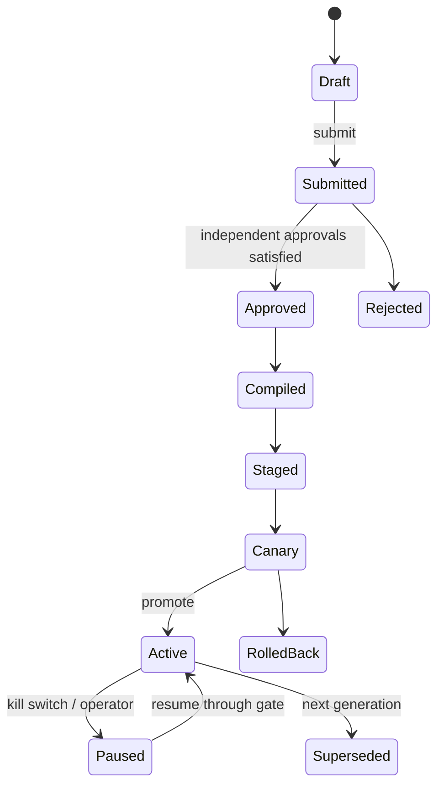
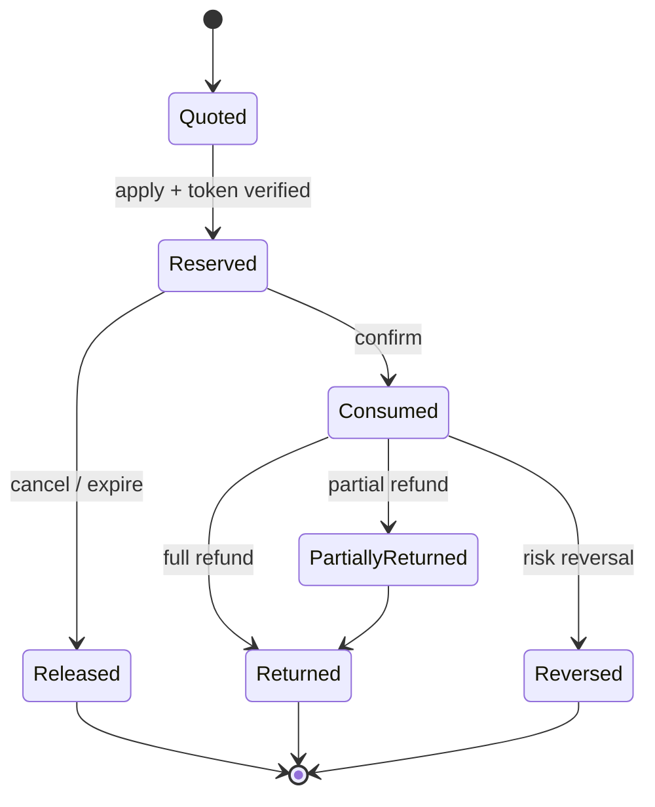

# 领域模型与业务不变量

## 聚合边界

| Context | Aggregate roots | 不放入同一聚合的内容 |
| --- | --- | --- |
| Control | Campaign、DefinitionVersion、ApprovalCase、ReleaseBundle | 大型图文档用版本内容/制品引用；Audience/Benefit 只存 typed reference |
| Audience | SegmentDefinition、SegmentVersion、Snapshot、ImportJob | 用户主档不归营销平台所有 |
| Decision | RuntimeGeneration、DecisionTrace | 不持有预算余额或券实例 |
| Benefit/Funding | PromotionApplication、ReservationGroup、ResourceAccount、CouponGrant | 订单实体只用 OrderRef/line refs |
| Journey | JourneyVersion、Enrollment、MigrationJob | Definition 发布后不原地修改；实例固定 version |
| Engagement | Consent、Suppression、TemplateVersion、ContactAttempt | Provider 原始模型经 ACL 映射 |
| Measurement | MetricDefinition、AttributionPolicy、ProjectionWatermark、RebuildJob | ClickHouse 投影不是 OLTP 权威状态 |

## 核心生命周期



发布后的 DefinitionVersion 与 ArtifactBundle 均不可变；修订产生新 version。提交人不能审批自己的版本，风险等级决定审批角色和人数。紧急开关只能收紧或关闭行为，不能绕过审批增加权益。



## 定价流水线

固定 stage 顺序为 item → shop → cross-shop → platform → coupon → shipping。每一阶段只消费前一阶段的确定金额；候选先按资格和 scope 过滤，再按 compatibility group/hit policy 求解，最后执行 caps/floors 和稳定 tie-break。不可使用浮点数，Money 使用币种 + 最小货币单位整数。

逐行分摊和 FundingShare 使用最大余数法：先算 floor，再按余数、稳定业务键排序补齐，因此满足：

```text
sum(lineDiscount) == offerDiscount
sum(fundingShare) == lineDiscount
lineFinal >= 0
同一规范输入、版本、币种产生相同输出
```

权重累计和中间乘法必须检查溢出；无效币种、负金额、零权重、超过 solver deadline 或组合规模上限直接失败，不静默近似。

## OfferToken 与履约边界

Decision 返回签名 OfferToken，至少绑定 `tenantId`、subject/order/cart digest、quoteId、release generation、artifact digest、benefit version、金额、币种、数量、expiry 和 nonce。Benefit/Funding 在 reserve 前重新计算 payload digest、验签、检查 expiry/tenant/generation，并用 nonce/commandId 阻止重放。任何失败返回机器可处理的 `REPRICE_REQUIRED` 或明确领域错误，不形成“订单价格已成功、权益却未保留”的隐式状态。

## AwardIntent、SKU 世代与发奖切流

- 营销权益定义以 `benefitDefinitionVersion=benefitId@version` 绑定权益中台的 `benefitSkuId + skuVersion`；发布 ACTIVE 定义时只接受仍为 ACTIVE 的 SKU，发奖时再从签名 OfferToken 重建权威项，内部触发请求不能自报金额。
- `sourceRequestId` 同时是营销侧首次结果幂等键和权益中台请求幂等键。首次结果只能落在 `mk_award_intent_outbox` 或 `mk_award_intent_block` 之一；重放不得重新风控、改模式或改 payload。
- `LEGACY` 表示旧链路拥有发放，`SHADOW` 只保存对比记录，`CENTER` 才进入权益中台 relay。模式在首次写入时固化，后续配置变更不能改变已受理意图的所有权。
- 发奖前风控使用 `sourceId=MARKETING_AWARD`。现金权益按 OfferToken 中同币种金额求和；无现金项使用正数哨兵 `amount=1,currency=XXX` 通过既有正金额契约，但哨兵不进入权益或对账金额。

ReservationGroup 默认全成全败。只有 Offer 明确选择 partial policy 才能部分成功，响应必须列出每个 applied/rejected item 与补偿状态。

## 资金和库存守恒

对每个 `ResourceAccount`：

```text
initial + replenished = available + reserved + consumed + expired + withdrawn
returned/reversed 通过成对流水回到策略指定 bucket
```

每次变更持有唯一 commandId、业务引用、版本、fencing token 和借贷方向。应用事务写 aggregate 与 ledger/outbox；对账从不可变流水独立重算余额，差异非零即冻结相关资源并告警。区域/分片 bucket 只能在 escrow 额度内消费，网络分区时不能从多个 region 同时借用同一余额。

`BUDGET` 账户根行只保存身份、状态和 fencing 元数据；新建账户按 `MARKETING_FUNDING_BUDGET_BUCKET_COUNT`（默认 16）把可用额度守恒分配到 `mk_resource_escrow_bucket`。常规 reserve 通过稳定散列选择一个容量足够的桶并执行条件更新，跨桶大额 reserve 才按固定顺序锁定多个桶；`mk_reservation_escrow_allocation` 固化每个预占的桶归属，使 confirm/release/refund 回写原桶。账户读模型与对账均以桶总和为余额权威，ledger 记录 bucket/version，根 fencing 推进时同步推进所有桶，既分散热点又保持总账守恒。

## Audience、Journey 与 Experiment

- Audience 字段定义包含来源、provenance、asOf/maxAge、missing/null policy、敏感等级和可用目的；调用方传来的“VIP=true”不是可信证据。
- SegmentVersion 产生不可变 snapshot。Decision/Journey 引用相同 snapshot identity；超过新鲜度时按定义阻断或使用可解释降级。
- Enrollment 由 `tenant + journeyVersion + subject + trigger dedupe key` 唯一确定；每个实例固定 JourneyVersion。Wait 的 deadline、timer generation 和已消费 eventId 存入 keyed state。
- 实际 Send/Grant/Webhook 前重新检查 consent、suppression、未成年人政策、quiet hours、frequency cap 和 contact idempotency。
- Assignment 不等于 Exposure。只有实际展示/触达/权益动作成功后记录 exposure；holdout 不执行营销动作。随机化单位和 mutual-exclusion layer 是 ExperimentVersion 的不可变部分。

## 退款与迟到事实

退款按原始 PromotionApplication 和 line allocation 回放，不能按当前规则重新定价。部分退款采用同一确定性分摊算法；券/赠品能否返还由原条款快照决定。迟到 conversion/refund 以 eventId 去重后写事实，归因投影可以按新 policy 重建但保留 policyVersion 和 calculationAsOf。
