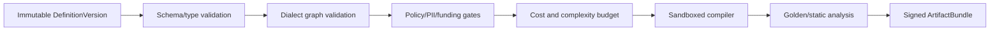

# 低代码语言、规则制品与运行时

## 为什么不是万能画布

平台共享类型系统、版本信封、节点注册表、画布交互和编译协议，但提供五种有边界的语言。这样运营获得低代码体验，运行时仍能做静态检查、成本预算和安全隔离。

| Dialect | 允许语义 | 禁止语义 | Runtime |
| --- | --- | --- | --- |
| `OFFER_DECISION_DAG` | scope、条件、候选优惠、组合/互斥、Terms | 环、Wait、Send、直接外部副作用 | 同步纯函数 Decision |
| `AUDIENCE_EXPRESSION` | typed predicate、集合运算、as-of/freshness | 任意 SQL、未注册 PII、外部网络 | batch + Flink incremental |
| `JOURNEY_STATE_MACHINE` | trigger、branch、wait、parallel、bounded repeat、Send/Grant/Webhook | 直接修改价格、无界循环、未声明副作用 | Flink keyed state/timer |
| `DMN_DECISION_TABLE` | typed input/output、hit policy、gap/overlap | 动态类加载、网络/文件 I/O | KIE DMN adapter |
| `BENEFIT_FUNDING_FORM` | resource、bucket、funding/return policy | 任意脚本或跨账本更新 | Benefit application service |

## Definition envelope

图契约在 `marketing-contracts/.../graph-definition.schema.json`。每份定义携带 tenant、dialect、definitionId/version、schemaVersion、registryVersion、nodes/edges、terms 与 canonical content digest。保存草稿可变；提交时生成不可变 DefinitionVersion。

NodeDefinition 必须声明：

- `type@semanticVersion` 与兼容的 ABI range；
- 输入/输出端口和 JSON type；
- required/missing/null semantics；
- 估算 CPU、内存、lookup 和 fan-out cost；
- side effect 分类（NONE、CONTACT、BENEFIT、WEBHOOK）；
- 可用 dialect、权限、敏感数据目的和 migrator。

客户端校验只改善体验，服务端 `GraphValidator` 才是权威门禁。canonical hash 对 map key、节点和边排序，不能依赖前端坐标或 JSON 属性顺序。

## 编译管线

Compiler 输入只允许已登记 schema 和 vendored dependency，不允许解析远程 `$ref`。生产 worker 应使用独立 namespace/runtimeClass，禁网、只读 rootfs、临时目录配额、CPU/内存/PID/时限和 seccomp；编译结果只通过 content-addressed ArtifactStore 输出。代码中的 compiler/service adapter 展示完整协议，本地默认内存存储；生产必须接 S3/KMS adapter。

ArtifactBundle 包含 dialect、engine/ABI、definition digest、registry snapshot、compiled payload、golden results、build metadata、SBOM reference 和签名。Runtime 验证签名、digest、tenant、engine/ABI 和 generation 后才加载；验签失败不允许降级到未签名内容。

## Drools 与 DMN 的使用边界

Drools executable model 只做受控条件匹配和候选推理；Money 计算、组合优化、分摊和资金改变保留在可 property-test 的纯 Java 代码。DMN 用于适合表格表达的 eligibility/classification，发布前检查类型、hit policy、gap/overlap 和测试行。DRL/DMN 不能调用网络、反射、系统时间或随机数；时间和随机桶必须作为显式 facts 输入。

## 兼容与迁移

平台支持当前 N 和 N-1 DSL/Artifact ABI：

1. 注册新节点版本，但不改旧版本语义。
2. 提供纯函数 migrator，输入旧 JSON，输出新 JSON + migration report。
3. 对存量定义 dry-run，比较 canonical semantics/golden corpus。
4. 用户确认后创建新的 Draft version；Published version 不原地覆盖。
5. 只有无旧定义、运行实例和 rollback generation 后才移除旧 runtime。

无 migrator 的 breaking change 必须换 major type/version 并保持旧实现。Journey migration 还必须检查当前节点映射、等待 deadline、并行 token 和已执行副作用；失败实例继续固定旧 version。

## 插件开发约束

扩展点是 schema、compiler adapter 或 provider connector，不允许上传任意 jar 后直接进入生产 JVM。插件必须具备源码审查、签名、SBOM、许可证/漏洞扫描、ABI compatibility test、恶意样例、资源配额和 canary。新增副作用节点必须定义业务幂等键、timeout/UNKNOWN 语义、retry classification、compensation 和审计字段。

## 测试层次

- 示例测试：每个节点/模板最小成功与失败样例。
- Property/metamorphic：金额守恒、顺序无关、稳定 hash、重复事件不重复副作用。
- Golden corpus：definition → artifact → evaluation 字节级快照。
- Fuzz/negative：环、炸弹图、深嵌套、无效 schema ref、NaN/溢出、未知节点、伪造签名。
- Differential/shadow：新旧 runtime 对同一录制事实比较，差异需分类并批准。
