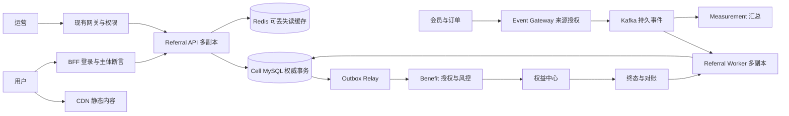
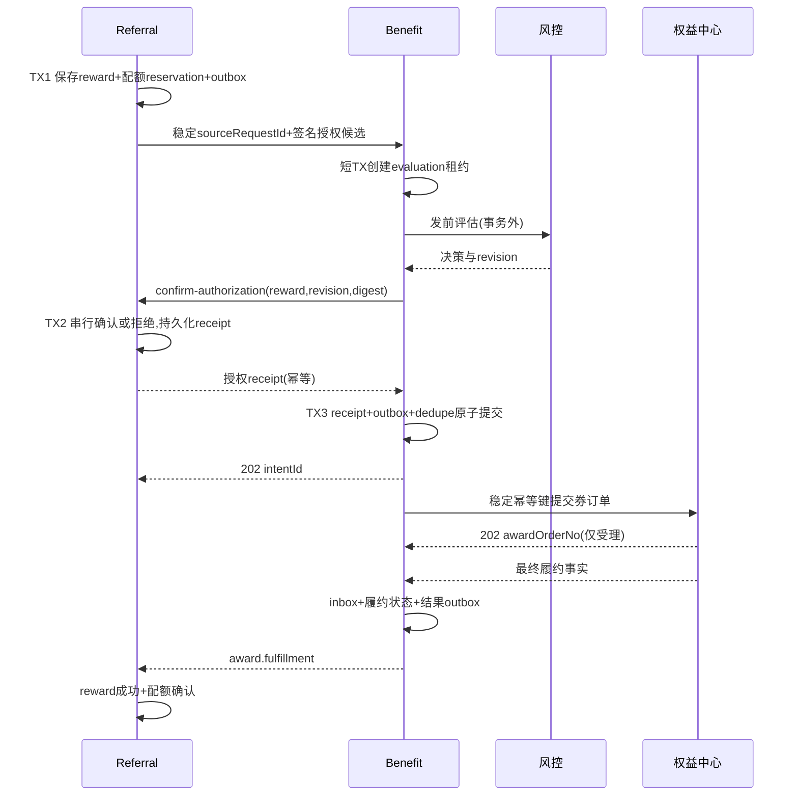

# 邀请有礼生产详细设计 v2

状态：生产设计评审稿；未实施、未压测、外部合同待双方验收。本文补充并覆盖 FINAL_PLAN 中涉及并发、配额、授权和恢复的简化描述。设计目标采用可度量的互联网高流量、高并发、高可用指标，不声称达到某家公司内部标准。

## 1. 文档与实现边界

| 材料 | 用途 |
|---|---|
| [FINAL_PLAN.md](FINAL_PLAN.md) | 业务范围、现有代码差距、逐文件任务、实施顺序 |
| 本文 | 架构、容量、设计模式、事务、状态机、生产运维 |
| [DATABASE_DESIGN.md](DATABASE_DESIGN.md) | 数据字典、键/索引/锁、迁移、注释规范 |
| [EXTERNAL_CONTRACTS.md](EXTERNAL_CONTRACTS.md) | 会员、订单、BFF、风控、权益中心的目标合同 |
| [ACCEPTANCE.md](ACCEPTANCE.md) | 可执行验收用例、阈值、证据和发布门禁 |
| [PROJECT_HIGHLIGHTS_AND_API.md](PROJECT_HIGHLIGHTS_AND_API.md) | 重点内容、API目录与开发任务入口 |

业务范围仍为直接邀请、注册或首单、固定券、双边和阶梯奖。架构不依赖修改现有 Journey 的主体模型；Journey 仅可选承接通知。所有数据库变更和业务实现属于后续实施，本轮交付设计材料。

## 2. 容量模型、SLO和硬边界

以下是目标容量包络，必须用指定硬件和真实数据分布验证，不能当作当前系统成绩。缺少真实业务量时先采用此基线，P0 用实际预测替换并记录批准版本。

| 负载 | 区域级持续目标 | 突发/热点目标 | 延迟/正确性目标 |
|---|---:|---|---|
| 公开静态活动页 | 100,000 请求/s（CDN层） | 3倍，10分钟 | 可缓存内容 p99≤100ms，不包括客户端公网距离 |
| 个性化进度/公开token解析 | 合计20,000 请求/s（服务入口） | 单热门token 5,000/s；3倍总量10分钟 | p99≤200ms；个人数据不经公共CDN缓存 |
| 加入/绑定 | 5,000 命令/s | 同一被邀请人1,000竞争请求；跨人流量独立统计 | p99≤300ms；归因唯一、租户越权0 |
| 权威业务事实 | 20,000 事件/s | 60,000/s，10分钟，可持久化排队 | 接入p99≤200ms；正常资格处理p99≤5s，观察期另计 |
| 奖励意图 | 2,000 意图/s | 逐人两份+阶梯额外放大 | 本地授权/入箱p99≤500ms；正常到账p99≤60s以外部合同为条件 |
| 运营查询 | 200 请求/s | 不与C端连接池共享耗尽预算 | p99≤1s；汇总水位正常≤60s |

区域参考部署8个cell，每个cell目标至少625绑定/s、2,500事实/s、250奖励/s；数值为分摊后的验收要求，不是单实例保证。campaign固定一个cell，保证跨邀请人的唯一绑定在同一MySQL权威库裁决。单个campaign不能跨cell直接双写；超出单cell实测容量时，采用专用扩容cell并限制准入，或另行设计跨分片归因目录协议，禁止无设计直接按邀请人分库。

单邀请人有效资格转换基线50次/s，批量处理上限100条/批、等待上限100ms，须按事件顺序输出每次变化及跨越档位，不能仅计算最终净增而漏掉奖励/追回语义。超过热点配额时进入持久待处理或429，不承诺单热点无限线性扩展。单热点排队最大延迟进入独立SLI。

规模基线：100个租户、10,000活动、1亿条历史关系、1,000万活跃关系；单活动100万关系；热点试验包括50%流量集中一活动和50%集中一邀请人。后一组是过载保护试验，不要求该热点按正常5s完成，但无关租户p99恶化≤20%、不丢已受理命令。

正常区域API月可用性目标99.95%，30天错误预算21.6分钟。两项并报：平台内部SLI和含外部依赖的用户旅程SLI；不能把依赖失败、正常包络内的429从可用性统计中抹掉。无效凭证/真实业务冲突作为预期业务结果单独统计，5xx/超时/包络内限流计失败。

正确性硬门禁：重复实发0、超数量配额0、跨租户读写0、已受理但最终无法追溯的命令0。发生此类问题停止发奖，不能用错误预算换取资金/权益错误。

### 容量测算方法

- 单cell所需副本数 `N ≥ ceil(目标QPS / 单副本实测安全QPS)`；再保证损失1个AZ后的剩余实测容量仍能承载正常目标。服务、数据库、Kafka、外部接口分别计算。
- 外部调用并发约为 `QPS × 响应秒数`；例如2,000/s ×0.2s=400个在途请求只是平均估计，还需尾延迟预算；不能把HTTP线程数直接设为400就认定达标。
- 消费积压恢复 `恢复秒数 = 积压条数 / (恢复消费速率 - 新入站速率)`；恢复速率必须大于入站速率。
- 20,000事件/s×1KiB×86400≈1.77TB/日原始流量；持续7日、3副本约37.2TB（未计索引、协议、压缩及余量）。这是若全天持续峰值的上界，按实际日均系数分别给预算，不能默认便宜地永久保留全部payload。
- 1亿关系按主记录+索引平均1KiB估算约102GB，证据、奖励、尝试、outbox会进一步放大；实测行长×数量×副本×备份系数才是磁盘申请依据。

## 3. 部署与流量隔离



API、事件worker、outbox/对账worker采用同一模块镜像的独立启动角色与Deployment，分开线程池、连接预算和HPA。CPU、队列滞后、在途外部请求共同驱动扩容；最大副本数由DB连接预算和Kafka分区数约束。不能开启无限线程/队列来吸收过载。

单区域3AZ，API/worker至少3副本并分散AZ；Pod反亲和、topologySpread、滚动maxUnavailable=0、PDB、启动/就绪/存活探针、优雅退出。PDB仅约束自愿中断，节点/AZ故障仍依赖副本与容量余量。[Kubernetes中断说明](https://kubernetes.io/docs/concepts/workloads/pods/disruptions/)

MySQL采用现网批准的跨AZ高可用单主方案，主写与资格关键读不走延迟副本；只读报表可用副本并返回水位。AZ故障RTO目标≤120s，已确认写RPO=0必须以数据库复制和故障提升协议验证；普通异步副本不具备该保证。若实际平台做不到，正式SLO须降级且启用恢复对账，不能在文档中声称零丢失。

跨区域采用主区域写、灾备区域待命；初始目标RPO≤5min、RTO≤30min，损失窗口通过上游事实及权益中心账单补齐。先隔离旧主写权限、取得新epoch、确认旧写路径已切断，再提升灾备；分区无法证明唯一写者时停止奖励写入。路由表(tenant,campaign→cell,epoch)版本化；迁移需暂停该campaign、清空在途、同步校验、切epoch、恢复，不在正常请求中动态重新哈希。

Kafka建议RF=3、min.insync.replicas=2、producer acks=all、幂等producer；客户端使用仓库锁定版本验证配置。acks及ISR保护Kafka副本写入，不提供MySQL/HTTP跨系统exactly-once。[Kafka配置依据](https://kafka.apache.org/11/generated/kafka_config.html)

生产使用独立可用性保障的基础设施；dev_infra只提供开发/联调共享实例和版本参考，不能把单机Compose当成三AZ方案。

## 4. 高流量读路径与过载保护

公开条款按campaign+definitionVersion做CDN/ETag；暂停信息短TTL并有服务端权威检查。token解析结果仅供展示，绑定仍查权威有效性。Redis存token摘要映射和脱敏进度投影；私有缓存键含tenant+subject+campaign+projectionRevision，查询结果含asOf/revision。

缓存填充采用single-flight、TTL抖动、短期负缓存与请求体/键长限制；缓存过期不触发无限并发回源。Redis故障时受控降速查库，熔断低优先级查询，绑定/发奖不能改用缓存真值。token不得进入日志、指标标签、第三方埋点和HTTP Referer传播。

网关/BFF按tenant、campaign、主体/IP摘要设置分层令牌桶；worker按tenant公平队列/并发额度处理。IP仅辅助，不作为身份唯一依据。429附Retry-After；客户端指数退避+抖动。单租户压满不能耗尽全局线程、DB连接或风控bulkhead。

初始超时预算：BFF总体1s；本地事务目标p99≤50ms（含锁等待），上限可配；内部只读HTTP300ms，风控800ms，权益提交2s。外部调用只在事务外。一个入口内总重试最多1次且仅针对明确安全的幂等读；业务投递持久化重试1s/2s/4s…封顶5min+抖动，24h后进入人工/对账队列，事实不删除。超时未知结果不能随意更换幂等键。

Kafka故障时Event Gateway只有持久化接入成功才返回202；受控outbox达到磁盘/条数阈值即503+Retry-After，禁止内存接收后称成功。已接收事实仍保留并恢复投递。事件风暴不阻塞kill switch和终态回调的独立通道。

## 5. 设计模式与可扩展点

| 模式 | 具体类/接口（拟新增） | 解决的问题与约束 |
|---|---|---|
| DDD聚合+Repository | ReferralParticipant/Qualification/Reward、ReferralRepository | 明确事务不变量；Controller不直接操作Mapper |
| 六边形架构/适配器 | CustomerEvidenceGateway、OrderEvidenceGateway、RiskGateway、BenefitOrderStatusGateway | 外部DTO不进入领域；第三方协议变化只改adapter |
| Strategy+受控Registry | QualificationStrategy，RegistrationStrategy/FirstOrderStrategy；RewardPolicy，PerRelation/Milestone | 增玩法通过版本化策略注册；未知策略拒绝，不能任意反射加载类 |
| Specification | NewCustomerSpec、WithinWindowSpec、NetAmountSpec | 组合可解释资格规则；输出稳定reasonCode+证据引用 |
| 状态机 | RewardTransitionPolicy、QualificationTransitionPolicy | 显式合法迁移和CAS；不由零散if随意覆盖终态 |
| Outbox/Inbox | ReferralOutboxRelay、InboxRepository | 本地事务和至少一次投递；重复消息幂等消费 |
| Saga/Process Manager | RewardFulfillmentProcess、CompensationProcess | 跨服务发奖/退款分步恢复；不假装跨HTTP大事务 |
| CQRS | 权威写模型 + 个人/运营/统计读投影 | 读写隔离，投影延迟明确；资格不读取统计库判断 |
| Bulkhead/Circuit Breaker | 按tenant和provider的隔离池 | 外部慢响应隔离；熔断不等于放行资格 |
| Escrow+Fencing | ReferralQuotaAllocator、QuotaBucket、epoch CAS | 热活动配额分桶、调拨与旧worker隔离 |

接口只围绕真实变点建立。首期不增加抽象工厂层层包装、通用工作流引擎、任意插件脚本；新助力/拼团后续可以复用合同和履约，但有独立聚合，不强行塞入Invitation策略。

## 6. 清晰的业务流程

### 6.1 发布

运营保存→类型化校验→同源仿真→冻结条款/SKU版本→多角色审核→签名编译→暂存→referral验签预热→runtime ACK→激活指令单调生效。能力注册表要求runtime=referral、ABI、数据schema版本、支持策略版本同时匹配。REFERRAL主定义绑定唯一，数据库键裁决。

### 6.2 加入与绑定

1. A加入时固定definitionVersion+generation；新邀请链接属于该participant。BFF从可信登录映射canonical subject，不采用请求体主体。
2. token生成256位随机数，只持久化摘要。为了重试能返回同一个token，API幂等响应中的明文token使用独立KMS密钥加密、最长24h留存；超过幂等窗口需显式新建token，不假称摘要可以反推出明文。token也可被单独撤销。
3. B登录后提交token+条款版本。token还原tenant/campaign/participant后与调用方tenant匹配，查时间、版本、主体角色。
4. 同一数据库内按tenant+campaign+invitee的归因唯一键创建关系。为禁止互邀，同时创建/检查主体活动角色占用记录；按两个subjectDigest的字典序加锁，防止A→B和B→A并发各自检查通过。
5. 首次绑定提交关系+审计+outbox，同一事务内固定规则。前端同键重放返回原绑定；其他邀请人抢占返回409；事实处理在后台完成，不把会员/订单远程调用夹在绑定事务中。

FIRST_VALID_BIND指身份、token、时间、条款和角色校验通过后首次被数据库接受的绑定，不是首次完成注册/首单资格的邀请。后续非新客/风控失败不会自动改绑给另一个邀请人；运营条款需明确这一区别。

### 6.3 事实、达标、人数与配额

事件归一化到可信累计快照，先落evidence及inbox；按subject索引定位该活动的relation。如果消息可关联多个活动，分解为确定性relation事件，每个关系独立事务，保留派生outbox直到全部投递完成，不能提交源offset后仅在内存fan-out。

观察期使用持久任务due_at+数据库时间+租约。worker多副本扫描锁定候选、短事务领任务、事务外查询证据、短事务CAS资格。`SKIP LOCKED`仅用于任务领取；资格和配额裁决使用实际锁或条件更新，不允许跳锁后误判“没有记录”。[MySQL锁定读取说明](https://dev.mysql.com/doc/refman/8.4/en/select.html)

达标/退款统一锁序：主体角色(仅绑定)→participant/progress→relation/qualification→reward按ID排序→quota bucket按ID排序。授权、取消、回调需锁reward时也遵循相同顺序；禁止反向持有bucket再等待participant。

每个relation维护evidence_revision与qualified_flag。false→true仅加1，true→false仅减1；重复/旧revision不变。跨门槛生成稳定reward身份；每个reward只对应一个受益人、一个SKU单位，quantity首期固定1；多张券用不同ruleId配置，从而避免订单项部分成功时配额定义不清。

### 6.4 高并发配额：本版替换单活动热行

campaign+rule总额度是冷路径上限C，预分配到B个bucket（基线64、按压测调整），每个bucket配额c_i，Σc_i≤C。bucket均在该campaign的权威库内。participant稳定选择bucket，发奖热路径只锁其bucket并用 `reserved+consumed+1≤allocated` 条件更新，与reservation/reward/outbox同事务。

总账户不在每次发奖时更新。每用户限制由participant/progress中的按rule唯一配额行锁定（见数据字典），不能只在全局bucket上判断。

bucket不足但全局可能仍有余量时记录WAIT_QUOTA并调度allocator，不立即对用户宣称全活动售罄。allocator冷路径锁总账户和按序的两个bucket，只转移空闲额度；提高fencing_epoch，旧worker更新失败后重读重试。最终全局无可分配额度且超过短等待窗口才标QUOTA_EXHAUSTED。分桶可能降低瞬时利用率，不保证全部额度立即可用。

守恒：每bucket `allocated=available+reserved+consumed`，均非负；reservation按reward唯一。未知/已受理奖励保留reserved；终态成功reserved→consumed；确认未发/撤回成功按政策释放；历史reservation留存。上限下降不能小于全bucket已占用，调拨只动available。恢复、调拨、补偿均带epoch与rowVersion；Redis计数不参与最终发券裁决。

### 6.5 发奖时序与崩溃恢复



授权使用“候选签名+持久确认receipt”两层。候选expiresAt只限制首次确认；receipt记录reward不可变声明摘要、授权序号、首次确认时间及当前补偿状态。confirm重放不会再占额度。风控和SKU校验在确认前完成；receipt到出箱之间崩溃时用同一业务键重试/对账，不能因Token过期释放授权。

| 崩溃/竞态点 | 恢复动作 |
|---|---|
| TX1前/后进程退出 | 未提交无效果；已提交由outbox接管 |
| 风控已完成但本地未记结果 | 同evaluationAttemptId查询/重试；provider须幂等或结果可查 |
| confirm响应丢失 | 重放confirm得同receipt；不新建reward |
| confirm成功、TX3未提交 | pending授权扫描调用benefit按sourceRequestId查询；缺失则重放，取消则建立撤销栅栏；不能直接释放 |
| TX3成功但R没收到202 | B按稳定键返回同intentId |
| X已接收但B超时 | UNKNOWN，按同键查询或重放；查询404不足以证明永远不会收到在途请求 |
| 取消先于X提交 | B持久cancel tombstone阻止本地新投递；X按同业务键原子取消/拒绝迟到创建，或保持UNKNOWN直到有可靠证据 |
| X成功回调与取消交叉 | 更新fulfillment事实，保留compensation=PENDING并追回；不能覆盖成正常完成 |
| 旧worker租约过期仍返回 | 所有本地写CAS owner+epoch；HTTP副作用另由X幂等保证 |

若权益中心不支持按sourceRequestId建立取消栅栏，缺失订单的404不能作为退款释放依据；保持CANCEL_PENDING、继续对账，直到确认终态或人工处理。这个合同缺口影响上线，不用定时器猜测成功取消。

### 6.6 状态正交化

不再把所有含义压入一个超长reward.status：

| 维度 | 取值 | 权威方 |
|---|---|---|
| entitlement_state | ELIGIBLE / INVALIDATED / EXPIRED | referral资格证据 |
| authorization_state | NONE / CONFIRMED / CANCEL_REQUESTED / CLOSED | referral授权receipt |
| risk_state | PENDING / ALLOW / REJECT / REVIEW / UNAVAILABLE | 风控决策投影 |
| delivery_state | NOT_SUBMITTED / PENDING / UNKNOWN / ACCEPTED / SUCCEEDED / FAILED_FINAL | benefit与权益中心 |
| compensation_state | NONE / PENDING / CANCELLED / REVERSED / MANUAL_REVIEW | 补偿过程 |

UI显示状态由上述维度确定性映射，API同时返回原维度和reasonCode。例：SUCCEEDED+INVALIDATED+PENDING显示“已发放，追回中”。每个输入事件有providerRevision；旧状态不覆盖新状态，但合法SUCCEEDED→REVERSED由新的补偿revision表达。

## 7. 安全、鲁棒性与数据生命周期

服务使用短期机器身份，生产禁止DEV头；JWT校验issuer/audience/exp/tenant权限，BFF用户断言绑定method+path+bodyDigest+jti，最长60s、时钟偏差≤30s。首次调用jti与幂等业务身份绑定，相同重放可返回原结果，不允许跨操作重放。

签名payload使用CanonicalMapCodec/明确字段顺序，包含keyId、算法允许列表；禁止任意算法回退。密钥在KMS/Secret管理，签发和验证权限分开；轮换重叠至少覆盖Token有效期，历史receipt依摘要和持久证明核验，历史公钥按证据保留策略保存。紧急撤销keyId时暂停该来源新授权并对账，不能删除历史证明。

运行许可默认maxStaleness=10s，正常kill switch端到端传播p99目标≤5s；超过10s无法核验许可时停止新授权及本地尚未发出的新奖励请求。已交到权益中心的在途命令走取消/对账，不能承诺开关瞬间撤销所有外部副作用；结果回流与补偿不因许可过期停机。

主体唯一比较采用身份系统canonicalSubject的精确字节/HMAC索引，不能受数据库大小写不敏感排序影响。密文主体单独存，加密密钥与索引HMAC密钥分离。索引密钥固定版本，轮换需双索引回填/冲突检查，不直接换密钥导致同用户第二条归因。日志不含token、身份证、手机或完整外部payload。

建议热证据30天、完整证据按活动最长结算/追回期+30天（初始上限180天），随后加密归档；奖励身份/取消墓碑/去重最低覆盖外部幂等期、最大重放期、最长补偿期，初始400天。实际保留期需要业务及数据治理确认，活动配置不得超过存储保障窗口。数据擦除时不能破坏未结清权益追踪，按既定治理流程匿名化/保留最小审计证据。

数据库损坏恢复校验归因唯一、reward唯一、bucket守恒、授权与外部订单匹配；报表可重建，权威记录恢复需对账。依赖抖动、毒消息、未知schema分别进入明确错误码和DLQ，人工重放需要权限、原因和审计，原eventId不换新ID绕过去重。

## 8. 注释、可维护性和质量门禁

所有新表、所有新列（含关联表、inbox/outbox、迁移元数据、分桶表）中文COMMENT非空；扩展旧表的新列同样要求。字段注释写业务意义、单位、状态含义、时区、敏感性或幂等用途。主键/索引的业务理由在迁移SQL注释写明。

所有新类/接口/record/enum及公共方法写中文Javadoc：职责、输入约束、返回语义、异常、副作用、事务边界；并发/关键分支注释说明“为什么”，避免 `// 更新状态` 这种同义复述。策略接口文档说明确定性要求和版本兼容限制，远程端口说明超时/幂等/UNKNOWN语义。

代码示意（设计规范，未新增业务类）：

```java
/**
 * 按单个邀请关系的权威证据修订资格。
 * 幂等维度为relationId+evidenceRevision；禁止在事务内访问外部订单系统。
 */
public interface QualificationStrategy {
    /** 返回可解释的资格结果；证据不完整必须返回PENDING，不得按不达标永久结束。 */
    QualificationDecision evaluate(FrozenReferralPlan plan, VerifiedEvidence evidence);
}
// 必须先锁参与者再锁奖励，退款和达标路径共享锁序，避免相反持锁形成死锁。
// 只在false→true时增加人数，重复消息和旧修订不应再次产生阶梯奖励。
```

实施新增注释检查CI：Java AST/Javadoc检查覆盖新增或修改的公共API；SQL在临时MySQL执行迁移后从information_schema核对表/列注释，不能仅用正则看到COMMENT字符串就通过。中文注释“为什么正确”由评审抽查，不以注释行数替代质量。

## 9. 实施追加清单

在FINAL_PLAN文件清单上追加：

- referral：`SubjectRoleGuard`、`CellRouteResolver`、`QuotaBucketAllocator`、`RewardAuthorizationReceipt`、`PendingAuthorizationReconciler`、`RewardStateViewMapper`、`ReferralTaskRepository`、`ConsumerSubjectIndex`；补数据库中的角色、任务、bucket、receipt、用户配额表。
- benefit：`CancellationFenceRepository`、`ReferralRiskAttemptService`、`AuthorizationReceiptVerifier`、`RewardStatusQueryController`；只在新sourceSystem启用新语义。
- contracts：授权确认/撤销receipt、按source查询、取消墓碑、风控attempt、订单累计快照Schema；新增策略能力描述。
- helm：拟新增`templates/pdb.yaml`与referral角色化Deployment支持、拓扑分散/资源预算/worker独立扩容；扩现有NetworkPolicy。基础设施具体HA操作在实际infra仓库落地。
- CI：拟新增`verify-schema-comments`与`verify-java-docs`、合同兼容检查、故障回归与报告目录；脚本路径在实现时固定到`scripts/`，本轮未声称已有。

## 10. 运维处置流程

P0正确性事故：报警→关闭新奖励签发和新来源投递→保持终态回流/对账→定位tenant/campaign/reward范围→导出差异和证据→按补偿合同处理→修复与回放验收→小流量恢复。事故处理不删inbox/outbox、不改历史签名、不手动把UNKNOWN改成功。

积压事故：先判断上游速率/单热点/外部限流/DB锁等待，再对对应tenant或provider降速；扩consumer前校验分区、DB连接和外部容量余量。自动告警包括队列最老年龄>30s、UNKNOWN>5min、对账差异>0、fencing拒绝异常升高、配额守恒错误。

发布流程：新表/兼容代码→合同验收→旧流回归→单租户一个活动→5%活动→25%→全量；每步观察至少一个正常履约周期，首个试点还需覆盖退款演练。这里是活动白名单逐批开放，不是改变已有参与者的规则版本。

最终生产准入必须具备ACCEPTANCE中的测量报告、外部合同签收和故障恢复证据；设计模式、组件数量、注释数量本身均不是上线证明。
