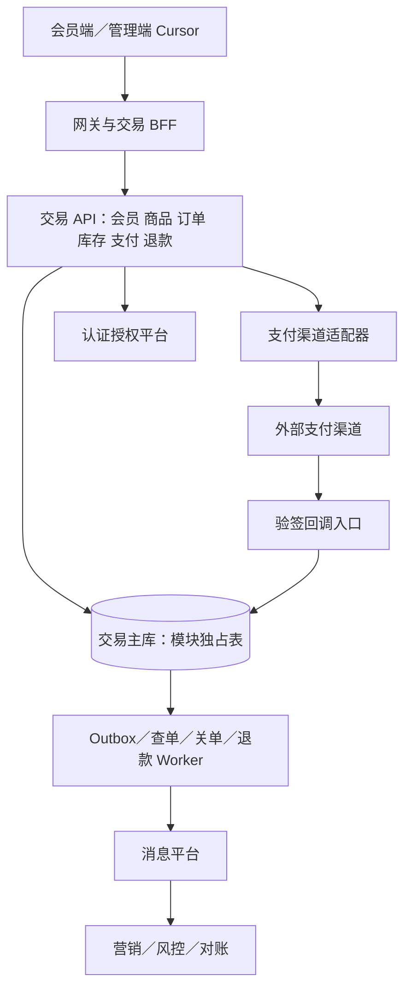

# 交易中心：生产详细设计与实施总纲

版本：1.1（明确 dev_infra 优先复用）；日期：2026-09-07；状态：待业务／架构／支付渠道评审的设计基线。本文没有宣称已实现、已压测或已获得外部合同签署。

## 1. 结论与阅读入口

新建业务系统 `transaction-center`（交易中心），包含会员、商品、库存、订单、支付、退款六个领域模块。用户指定的四项能力不能单独构成闭环，订单与退款是必要组成部分；首期不拆成六个独立微服务。

交付文档：

- [生产详细设计与实施总纲](FINAL_PLAN.md)：边界、流程、一致性、三高、代码改动、发布。
- [数据库设计](DATABASE_DESIGN.md)：表／字段字典、约束、索引、注释与迁移规范。
- [外部合同及 API](EXTERNAL_CONTRACTS_AND_API.md)：身份、订单、支付、退款、事件及现有系统改造。
- [可验证验收标准](ACCEPTANCE.md)：业务、并发、故障、性能、安全和注释质量门禁。

与已有[裂变生产方案](../referral-campaign-20260907/PRODUCTION_DESIGN.md)衔接：交易中心作为注册、消费与退款事实源；营销负责邀请归因和奖励，不能自行伪造交易事实。

## 2. 范围与明确不做的内容

| 模块 | 首期负责 | 不负责 |
|---|---|---|
| 会员 | 注册、登录主体映射、状态、资料、同意记录、消费事实、新客证据 | 重新实现 Casdoor 密码／登录体系；跨租户身份合并 |
| 商品 | SPU/SKU、规格、固定价格、版本、上下架、可售类型 | 搜索推荐、供应商采购、复杂促销计算 |
| 库存 | 仓库、SKU 库存、预占、确认扣减、释放、调整、退货入库、流水 | 完整 WMS、物流运输、财务成本核算 |
| 订单 | 服务端报价、快照、创建、取消、支付关联、履约／完成、首单事实 | 多商家购物车拆单、跨币种订单 |
| 支付 | 支付意图、渠道适配、回调验签、查单、关单、实收事实、异常补偿 | 储值钱包、清结算平台、银行卡数据存储、支付牌照能力 |
| 退款 | 退款额度预占、审批接入、原路退款、查询、部分退款、退货联动 | 将退款成功直接等同于退货验收入库 |

首期约束：一个订单一个商户、一个币种、一次足额支付；允许分次部分退款。一次支付意图只能有一个活跃或 UNKNOWN 的渠道尝试。实物订单首期单仓履约，多仓拆单另立需求。零元订单采用明确的零元完成流程，不伪造第三方支付成功，默认不计消费首单。

## 3. 现有能力与复用边界

以下是已核对的仓库能力，而不是凭图片端口判断完整性。源码路径相对 `/Users/liruijun/personal/LLM/`；详细原始审计见[跨项目审计](../referral-campaign-20260907/CROSS_PROJECT_CAPABILITY_AUDIT.md)。

| 系统／证据入口 | 复用 | 本次需要新增或修改 |
|---|---|---|
| `auth-platform/.../AuthzController.java` | `/v1/check` 等鉴权；Casdoor 登录 | 交易资源／操作权限、服务身份；新增会员主体映射，不复用管理员 ID 当会员 ID |
| 当前营销平台及其 offer 合同 | 活动与营销资格 | 增加交易事实消费者、证据查询适配；订单预留营销快照字段，营销不可直写交易表 |
| `benefit-center/.../AwardOrderController.java` | 发奖和按来源查询 | 首期不依赖优惠券核销；后续补券预占所有权、释放和补偿合同后才开放优惠购 |
| `benefit-center/.../WalletEntryCommandController.java` | 已有 freeze/redeem/refund | 未确认存在 unfreeze；其 refund 不是现金退款，不能冒充券释放 |
| `risk-platform/fraud-gateway/.../RiskController.java` | `/api/v1/risk/evaluations` 支付风险判断 | 支付字段适配；注册／新客风险场景需要扩展，不假称已支持 |
| workflow 的 `StartProcessCommandV1` | 异常退款审批 | 新交易审批类型、幂等回执、审批结果关联；不让每笔下单同步经过流程引擎 |
| recon 的 `BenefitOdsConsumer` | 已有对账框架 | 新交易／渠道账单导入、支付及退款差异规则、人工处置；权益对账不等于资金对账 |
| `dev-infra` | 本地公共中间件复用 | 核对实际版本和容量后复用；开发单实例不能算生产高可用 |

这里的路径末段用于定位类，实施时必须把完整路径、提交 SHA、实际合同版本登记到联调清单。

## 4. 架构和部署

首期是模块化单体、可分角色部署：API、回调入口、Worker 使用同一发布版本和一致数据库协议，分别扩容与限权。领域之间只调用公开应用接口，不跨模块访问 Mapper；订单编排可在同一数据源的本地事务中调用库存端口完成预占。此处 ACID 成立的前提是同一数据库事务管理器；未来拆库后必须改为显式 Saga，不能保留“本地事务保证一致”的说法。

默认单 cell 起步，多 AZ 高可用。容量超出经压测证实的单 cell 边界后，按稳定租户路由扩展 cell；超大租户独立 cell。路由登记在控制面，禁止简单改变 hash 取模导致历史订单不可达。首期不做租户内分库，会员首单唯一性和资金事实仍在同一 cell 事务内保证。

技术起点复用当前仓库的 Java 21、Spring Boot 4.0.2、MyBatis/Flyway 等已锁定技术栈。数据库和公共中间件优先使用 Docker 中 dev_infra 已提供的实例，镜像与版本优先保持一致；本机实际目录、Compose 项目及网络名称使用连字符 `dev-infra`。已核对其提供 MySQL 8.4，交易数据库直接以此为基线，不另起 MySQL／PostgreSQL 实例。这不是“最新安全版本”的承诺，实施前仍需检查客户端兼容性、镜像摘要及漏洞。

### 4.0 dev_infra 复用清单与隔离要求

2026-09-07 只读核对了 `dev-infra/compose.yaml`、`dev-infra/marketing/compose.yaml` 和运行容器的镜像、端口、网络。以下版本为当前镜像标签，不代表已核验内部二进制补丁号或完成服务连通性测试；实施时记录实际 digest。

| 用途 | 优先复用服务／镜像 | 容器内地址；宿主机地址 | 交易中心隔离方式（拟新增） |
|---|---|---|---|
| 关系数据库 | `mysql84`／`mysql:8.4` | `infra-mysql84:3306`；`127.0.0.1:43306` | 新建逻辑库 `transaction_center`；应用账号与迁移账号分离，仅授权该库 |
| 缓存与限流辅助 | `redis7`／`redis:7-alpine` | `infra-redis7:6379`；`127.0.0.1:46379` | 键前缀 `trade:<env>:<tenantId>:`；专用 ACL 用户（需配置），不能仅靠逻辑 DB 当安全边界 |
| 领域事件 | `kafka38`／`apache/kafka:3.8.0` | `infra-kafka38:9092`；`localhost:49092` | `trade.*.v1` topic；交易消费者组 `trade-<env>-<purpose>-v1`，跨系统消费者各自独立组 |
| 账单／验收证据对象存储 | `minio`／`minio/minio:RELEASE.2025-09-07T16-13-09Z` | `infra-minio:9000`；`127.0.0.1:49000` | 私有 bucket `trade-<env>-evidence`，独立凭据、保留策略和审计；不存支付密钥 |
| 配置／注册（按需） | `nacos243`／`nacos/nacos-server:v2.4.3` | `infra-nacos243:8848`；`127.0.0.1:48848` | 独立 namespace/group；先验证客户端与 Boot/Cloud 兼容性，不强加未验证依赖 |
| 遥测采集 | `marketing-otel-collector`／`otel/opentelemetry-collector-contrib:0.159.0` | `infra-otel-collector:4317/4318`；`127.0.0.1:4317/4318` | 独立 `service.name`、环境及 cell 标签；复用采集链路 |
| 指标与告警 | 已有 Prometheus `v3.13.1`、Alertmanager `v0.28.1` | 复用 `dev-infra/marketing` 配置 | 新增交易抓取目标、规则及告警路由，不覆盖现有规则 |
| 日志／链路／看板 | 已有 Loki `3.7.6`、Tempo `3.0.0`、Grafana `13.2.0` | Grafana 宿主机 `127.0.0.1:3001` | 新增交易数据标签、仪表盘目录和访问权限，不复制观测集群 |

约束与落地方式：

- 交易项目 Compose 默认只声明应用角色，引用 external 网络 `dev-infra`；不用固定容器 IP，不把容器内 localhost 当公共组件地址，不复制公共数据卷。跨 Compose 的依赖由应用重试与就绪检查处理，不能用本项目 `depends_on` 假定外部服务存在。
- 宿主机运行使用发布端口，容器运行使用网络别名；Kafka 必须分别使用匹配的 advertised listener，不能仅替换 bootstrap 地址忽略 broker 返回地址。以上为当前本机端点，生产通过环境配置注入。
- Kafka 作为本方案唯一默认事件总线；已有 RabbitMQ／PostgreSQL／ClickHouse 不因“已经有”就新增依赖。统计确有需求时再复用 ClickHouse；不得用其代替交易主库。身份继续复用已选 Casdoor，不因 dev_infra 存在 Keycloak 而切换身份体系。
- 默认任务由交易 Worker＋数据库任务表执行，不额外搭建调度中间件。KMS／生产密钥托管尚未在本次清单证实，保留外部安全能力接口，不能声称 MinIO／Nacos 可以替代 KMS。
- 独立逻辑库、账号、键／topic／bucket 命名和配额是复用前提；共享实例不允许跨项目直接写表、共用 root 业务账号、执行 FLUSHALL、删除公共 topic／卷。新增资源由限定范围的初始化脚本管理，密码不写入设计文档。
- 生产优先沿用同一组件体系与兼容版本，并部署满足 SLA 的隔离与高可用拓扑；不是让生产连接开发容器。开发单节点不能证明多 AZ、复制因子或 RPO=0。若共享实例无法满足隔离／容量／安全要求，先评审升级公共设施或受控独立部署，记录原因与批准，再变更，禁止擅自另起一套。
- 压测、断网、切主、清理等破坏性测试必须用按 dev_infra 镜像基线建立的授权隔离环境；不能对当前被其他项目共用的实例直接做故障注入。

配置证据：基础组件见 `../dev-infra/compose.yaml:9`（MySQL）、`:59`（Redis）、`:87`（Kafka）、`:148`（MinIO）、`:172`（Nacos）；观测组件见 `../dev-infra/marketing/compose.yaml:59` 起。路径相对当前营销仓库根目录。

### 4.1 模块与设计模式

| 模式 | 落地类／接口（拟新增） | 解决问题／限制 |
|---|---|---|
| 六边形架构 | `PaymentChannelPort`、`MemberIdentityPort`、`RiskDecisionPort` | 领域不依赖第三方 SDK；渠道差异不能泄漏到订单 |
| 策略＋注册表 | `PaymentChannelRegistry`、`NewCustomerPolicy` | 按渠道／版本选择策略；未知策略拒绝，不静默使用默认值 |
| 显式状态机 | `OrderStateMachine`、`PaymentStateMachine`、`RefundStateMachine` | 禁止乱序通知把成功回退为失败 |
| 应用编排／Process Manager | `CheckoutService`、`PaymentResolutionJob` | 本地事务与外部调用分段，超时可恢复 |
| Repository | `OrderRepository`、`InventoryRepository` | 聚合边界和 CAS 更新；不做无业务价值的万能基类 |
| Outbox／Inbox | `OutboxPublisher`、`InboxConsumer` | 至少一次消息投递＋业务去重，不宣称跨系统 exactly-once |
| CQRS 轻量读写分离 | `CatalogQueryService`、商品版本缓存 | 高流量商品读可缓存；付款／库存判断不能读延迟副本 |

ArchUnit 限制模块依赖、禁止跨模块 Mapper、禁止领域代码依赖渠道 SDK。公共共享包只放 ID、金额、时间、错误类型，不能变成所有业务都依赖的“大杂烩”。

## 5. 业务口径与不变量

1. 金额统一币种最小单位的整数，不用浮点；报价与订单冻结商品、价格、规则版本。渠道实收与应付分别记录，绝不能用前端金额结算。
2. 库存按 SKU／仓库维护 `available + reserved + sold = stock_total`；到货／盘点／退货入库同步调整总量并记流水。退款只改变资金，不自动改变实物库存。
3. 同一业务扣减、确认、释放必须有唯一操作键；数据库条件更新保证余量非负，Redis 锁不是正确性根基。
4. 一个订单至多履约一次，但必须记录所有真实成功收款。异常重复收款进入多付处理，不能因订单已付就丢掉第二笔钱的事实。
5. 累计成功退款＋进行中预占退款不得超过可退实收。超时保持 UNKNOWN 并查单，不擅自当失败释放额度。
6. 新客策略显式版本化：`REGISTERED_DURING_CAMPAIGN_V1` 与 `NEVER_CONFIRMED_PAID_V1` 是不同判断。风控身份去重与会员历史事实分层，不保证仅凭手机号识别同一个自然人。
7. 首单定义为 `FIRST_CONFIRMED_PAID_ORDER_V1`：会员在交易主库首次确认的有效足额支付订单，而非渠道时间最早的订单。并发靠会员事实行锁／CAS 和唯一约束选定。迟到支付不倒换已确定首单；退款不清除首付历史、不把老客变回新客。需要“渠道时间最早”时必须另做延迟决策方案。
8. 支付成功 `paidAt` 与商业完成 `completedAt` 分开。营销奖励可等待交易完成或售后观察期；退货、部分退款影响净支付门槛和奖励资格，不篡改原支付事件。
9. 新客查询返回事实及策略版本，不返回一个没有原因的布尔值。查询“未支付”只是时点证据，不承诺未来仍新客；按首单结果最终确认消费奖励。

## 6. 核心流程与竞争处理

### 6.1 注册／报价／下单

1. 网关验证登录凭据，交易端再次验证可信服务身份和会员归属；按租户＋issuer＋subject 幂等注册。会员记录与注册 Outbox 同事务提交。
2. 服务端读取已发布 SKU 版本，确认数量／币种／价格和可售状态，生成有有效期的报价快照。首期固定价，不假装已接通优惠券。
3. 创建订单携带报价 ID 和幂等键。同一本地事务校验报价、持久化订单和明细、条件预占库存、记录预占流水和 Outbox；任一 SKU 不足全部回滚。锁顺序固定为仓库＋SKU ID，死锁有限重试。
4. 响应丢失时客户端用同一幂等键重试取得原订单。库存缓存只供展示，不用于接受订单。

### 6.2 支付／回调

1. 事务内建立支付意图和渠道尝试，冻结商户、金额、币种、渠道请求号；提交后调用风控／渠道，不持有数据库事务等待网络。
2. 风控拒绝则不发起渠道支付；超时遵循分场景策略。资金高风险写默认拒绝或等待，不 fail-open。零金额不塞给要求 amount>0 的现有风控合同。
3. 渠道创建超时进入 UNKNOWN；用相同渠道请求号重试或查询，禁止换新号盲付。切换渠道前必须确认旧尝试终态不可支付。
4. 回调先按原始报文验签和商户映射确定租户，再校验金额／币种／交易号。接收事实持久化成功才返回渠道成功应答；数据库不可用返回可重试失败。
5. 异步业务处理在事务内记录唯一渠道成功收款、推进订单状态、预占转已售、首次支付事实、账本与 Outbox。消费者重复／乱序均不能产生第二次扣减或履约。
6. 金额异常仍记录已收到的真实资金，标记待核对，不确认正常订单；必要时原路退款。回调验签失败不写成功资金事实。

### 6.3 超时关单与库存释放

`PENDING_PAYMENT → CLOSING → CANCELLED`；成功支付走 `PAID → FULFILLING → COMPLETED`，退款另设财务状态，避免订单枚举爆炸。

- 未提交任何渠道请求：同一事务设置关单屏障、禁止后续创建尝试，再释放预占。
- 已提交或状态未知：先 CLOSING，查单／渠道关单。只有得到渠道“不会再成功扣款”的终态承诺后才释放库存；普通 HTTP 200 或本地 TTL 到期不是承诺。
- 查到成功则转支付成功处理，不释放库存。渠道不提供可靠关单语义时，限制该支付产品上线或保留预占至可证明终态，并通过超时告警／人工流程处理。
- 已确认终态后出现矛盾的迟到成功：记录资金、报警及幂等补偿退款，不复活无库存订单。网络调用与关单工作者的竞态必须由渠道幂等请求号和持久终态约束兜底，不能仅靠进程锁。

### 6.4 退款／退货／营销追偿

1. 根据原支付流水申请退款，事务内预占可退额度，按订单明细确定退款归属。首期不含优惠分摊；后续折扣按确定性的最大余数法分摊并冻结明细，禁止每次退款重新算优惠。
2. 大额／异常退款交流程平台审批；审批结果幂等消费。已批准后使用稳定渠道退款号调用原渠道。
3. 成功通知／查单确认后，事务内释放进行中额度、累计已退金额、记录资金账本与退款事件。重复通知不多退，失败终态才释放预占；UNKNOWN 保持预占。
4. 实物退货走收货验收记录和唯一入库操作；只有验收通过可售商品才加可售库存。退款拒绝或成功均不能自动伪造收货。
5. 营销读取退款后净支付和首单事实，执行既有奖励取消／追偿流程；交易中心不直接修改权益钱包。对账负责确认渠道与本地差异并触发受控修复。

## 7. 三高容量与高可用设计

下列是建议的首期验收目标，不是现有系统实测能力；评审后冻结硬件、数据量、渠道限额与压测脚本，再验收。

| 指标 | 单 cell 建议目标 | 口径 |
|---|---|---|
| 商品查询 | 10,000 RPS；P99≤200ms | 95% 缓存命中，另测冷缓存；不含 CDN 静态资源 |
| 创建订单 | 500 RPS；P99≤800ms | 每单平均 3 SKU，含库存本地提交；至少 20% 热点 SKU |
| 支付创建 | 300 RPS；本地受理 P99≤500ms | 异步受理，不包含用户支付和渠道耗时 |
| 回调持久接收 | 2,000 RPS；P99≤300ms | 验签＋入库；业务处理积压 P99≤10s |
| 退款申请 | 100 RPS；本地受理 P99≤500ms | 渠道退款完成时间单独记录 |
| 可用性 | 月度 99.95% | 合法请求成功受理；30 天错误预算约 21.6 分钟；排除合法业务拒绝，不排除内部故障 |

单 cell 基准起点：API 3×4 vCPU/8GiB、回调 3×4 vCPU/8GiB、Worker 3×4 vCPU/8GiB；MySQL 主实例 16 vCPU/64GiB 加跨 AZ 副本；Redis／消息平台生产集群另计。资源不是达标保证，数据库 IOPS、RTT、签名算法与热点会影响结果。先测到真实拐点，再确定生产规格；多 cell 不能未经验证直接宣称线性扩容。

- 高流量：CDN 只承载静态资源／公开商品；缓存版本键、TTL 抖动、单飞回源、负缓存与限额，发布事件失效并有 TTL 兜底。价格最终以有效报价／订单快照为准。
- 高并发：索引命中、短事务、固定锁序、有限重试、连接池预算、批量 Outbox。热点 SKU 默认每键排队／限流；只有基准不足才启用预分配库存桶，桶额度总和不能超过实际可售量，迁移需 fencing，不能生成虚拟库存。
- 高可用：三 AZ、反亲和、就绪检查、优雅下线、滚动发布、PDB；PDB 仅约束部分主动中断，不是故障容灾保证。数据库故障切换要求单写和旧主隔离，支付任务 lease＋版本令牌防僵尸工作者。
- 同城已确认交易 RPO=0 是目标，须由实际数据库同步持久化／故障提升策略证明；异步副本不能声称 RPO=0。建议单 AZ 故障 RTO≤5 分钟；异地备份恢复 RPO≤5 分钟、RTO≤30 分钟需演练后签署。
- Redis 故障允许限量读主库，超过安全预算返回 429/503，不让缓存雪崩拖垮资金写。消息故障由 Outbox 保证事实不丢，积压达到磁盘安全阈值则停止新增写流量。
- 单渠道熔断不得把 UNKNOWN 支付自动切到另一渠道；可对新订单切换，经商户路由配置批准生效。查询、回调、退款各有隔离线程池与限额。
- 可观测：API RED、主库锁等待、连接池、库存拒绝、支付 UNKNOWN 年龄、回调验签失败、Outbox 最老年龄、退款预占、资金差异、租户热点；日志关联 traceId/orderId，不输出支付密钥和个人明文。

## 8. 安全与运维

会员端只操作当前身份所属会员；管理端按租户和业务操作鉴权；内部接口 mTLS／服务令牌＋audience＋最小权限，不能信任客户端传入的 tenantId/memberId。回调租户从验签后的商户配置映射得出。

敏感字段加密，检索使用带密钥摘要，密钥托管 KMS，支持版本轮换。手机号不自动等于唯一自然人。使用渠道托管收银台／令牌化，不保存卡号、CVV 或银行卡原始认证材料。删除／匿名化会员不删除有保留义务的资金审计事实；具体留存期限在上线前由业务与合规确定。

配置变更、库存调整、退款审批、异常修复全部审计；人工处置只发业务命令，不直接改资金表。渠道证书轮换支持双版本过渡，验签日志脱敏。恢复备份在隔离环境进行，严禁恢复演练重新触发真实支付／退款。

## 9. 具体新增／修改清单与交付阶段

以下是拟新增文件结构，尚未创建业务项目。Java 包暂定 `com.lrj.trade`。

| 位置 | 新增／修改内容 |
|---|---|
| 新仓库 `transaction-center/pom.xml` | BOM、模块、测试与注释门禁；沿用兼容版本，不复制无关服务依赖 |
| `transaction-contracts/src/main/java/.../contract/` | DTO、错误码、事件 V1、金额类型、外部版本合同 |
| `transaction-member/.../` | `MemberRegistrationService`、`MemberIdentityRepository`、`NewCustomerPolicy`、消费事实查询 |
| `transaction-catalog/.../` | `ProductPublicationService`、`QuoteService`、SKU 版本和快照 |
| `transaction-inventory/.../` | `InventoryReservationService`、`InventoryAdjustmentService`、`ReturnRestockService`、条件更新 Mapper |
| `transaction-order/.../` | `CheckoutService`、`OrderStateMachine`、`FirstPaidOrderService`、证据查询 |
| `transaction-payment/.../` | `PaymentChannelPort`、注册表、验签适配器、支付／退款状态机、账本、额度预占 |
| `transaction-integration/.../` | Auth、Risk、Workflow、Marketing、Recon 防腐适配层；Outbox／Inbox |
| `transaction-server/.../web/` | Member/Catalog/Order/Payment/Refund/InternalEvidence 控制器、统一错误和鉴权 |
| `transaction-jobs/.../` | 发布消息、支付查单、关单、退款查单、库存异常核验、对账修复任务 |
| `transaction-server/src/main/resources/db/migration/` | `V001__member_catalog.sql`、`V002__inventory_order.sql`、`V003__payment_refund.sql`、`V004__integration_audit.sql`；全部表字段注释 |
| `architecture-tests/`、各模块 `src/test/` | 边界测试、属性测试、数据库并发与故障测试、合同测试 |
| `deploy/`、`observability/`、`docs/` | dev-infra 接入、生产角色部署模板、仪表盘、告警、Runbook、OpenAPI／AsyncAPI |
| `db/seed/dev/` | 幂等种子 SQL／脚本：会员、商品、库存、订单场景；禁止真实个人数据，生产禁用 |
| auth-platform | 交易权限和服务身份配置，后端校验适配 |
| marketing-lowcode-platform | 消费注册／首付／完成／退款事件；新增交易证据客户端；保持营销归因权属 |
| recon-platform | 交易支付／退款账单场景、对账规则、差异工单；修复命令审计 |
| risk-platform / workflow-platform | 支付适配及新增场景合同、退款审批流程与回执 |
| 前端（Cursor） | 交易中心导航、会员／商品／库存管理、订单／支付／退款详情、异常工单；严格接口取数 |

阶段与出口：

1. P0 合同冻结：支付渠道及商户、业务口径、部署资源、权限矩阵、数据留存、接口版本签署；未确定真实渠道可做适配骨架／沙箱，不能发布真实收款。
2. P1 基础与会员／商品：迁移、注释门禁、鉴权、会员注册、商品发布、报价、数据库种子；合同测试与租户越权测试通过。
3. P2 库存／订单：预占、取消、幂等、状态机、首单事实框架；库存守恒、重复下单、锁竞争用例通过。
4. P3 支付／退款：渠道沙箱、回调、关单、UNKNOWN、并发退款、账本；渠道合同认证及故障矩阵通过。
5. P4 跨系统联调：营销、风险、审批、对账；覆盖注册→邀请→首单→完成→退款→奖励取消／追偿闭环。
6. P5 生产门禁：压测、容灾、备份恢复、安全扫描、灰度演练、Cursor 页面验收；未达标项有明确阻断而不是写“基本完成”。

时间估算待团队人数和渠道接入条件确认，不承诺用固定天数交付全部支付生产能力。迁移用 expand-contract：先加兼容字段／事件，再切读写，观察后删除旧路径；首期无历史交易迁移，若发现外部存量交易必须补历史导入及首单切换水位方案。

灰度按测试商户→小租户→比例放量；紧急开关可关闭新支付／新订单，但回调、查单、退款和对账不能一起关闭。回滚只回退兼容应用版本，禁止直接降级／删除已写入的资金表；支付在途保持原渠道请求号和解析能力。

## 10. 项目重点与设计复核结论

重点不是“微服务数量”，而是：可信会员身份、商品价格快照、库存守恒、支付终态证据、退款额度隔离、首单事实稳定、消息可重放、资金可对账、全链路权限和可演练恢复。

本轮按证据收集→设计→反例复核顺序完成，未进行跨模型或多代理评审。复核明确排除：把退款当库存入库、把 TTL 当支付关单、把权益 refund 当现金退款、把异步副本当零数据丢失、把新客快照当永久承诺、把架构图当吞吐证明。

参考官方资料（原则参考，不表示已选定支付商）：[MySQL 锁定读](https://dev.mysql.com/doc/refman/8.4/en/innodb-locking-reads.html)、[Kubernetes 中断与 PDB 边界](https://kubernetes.io/docs/concepts/workloads/pods/disruptions/)、[Stripe Webhook 验签与重复／乱序通知](https://docs.stripe.com/webhooks)。实际渠道须提供自己的可测试合同。
